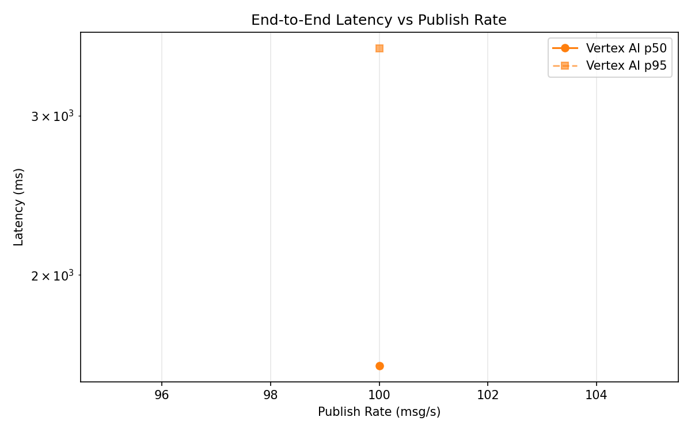
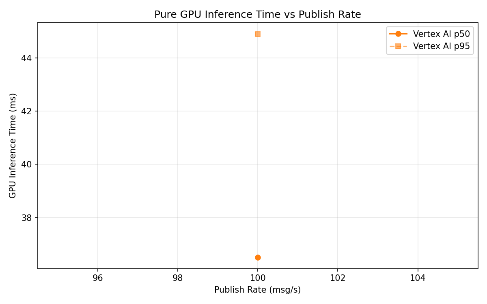

# Benchmark Report

Generated: 2026-03-08 20:29:50

## Configuration

| Parameter | Value |
|---|---|
| Messages per phase | 100s per phase |
| Rates (msg/s) | 100 |
| Experiments | Vertex AI |

## Throughput

| Rate (msg/s) | Vertex AI |
|---|---|
| 100 | 97.8 |

## End-to-End Latency (ms)

| Rate | Percentile | Vertex AI |
|---|---|---|
| 100 | p50 | 1587.0 |
| 100 | p95 | 3564.1 |
| 100 | p99 | 5115.0 |

## GPU Inference Time (ms)

| Rate | Percentile | Vertex AI |
|---|---|---|
| 100 | p50 | 36.5 |
| 100 | p95 | 44.9 |
| 100 | p99 | 55.7 |

## Charts

### Latency vs Publish Rate

### GPU Inference Time vs Publish Rate

### Throughput vs Publish Rate

