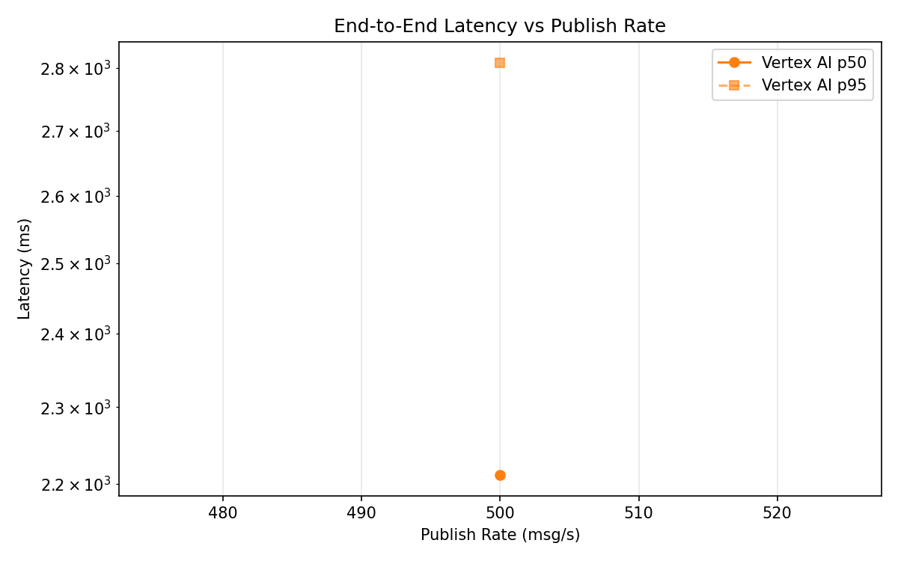
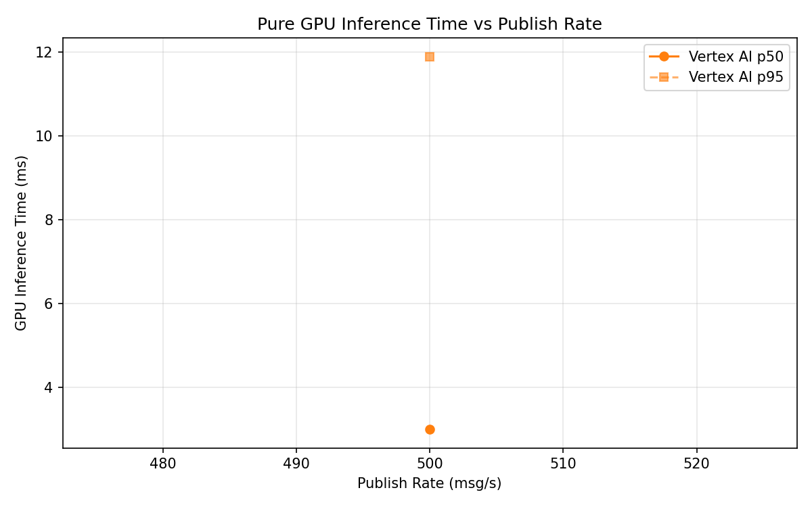
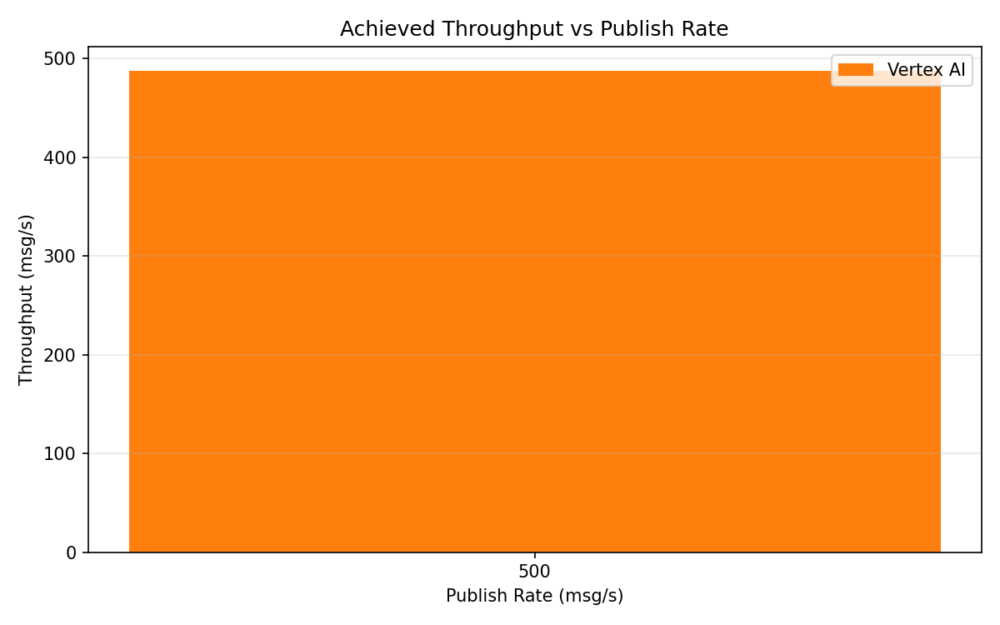

# Benchmark Report

Generated: 2026-03-08 21:34:49

## Configuration

| Parameter | Value |
|---|---|
| Messages per phase | 100s per phase |
| Rates (msg/s) | 500 |
| Experiments | Vertex AI |

## Throughput

| Rate (msg/s) | Vertex AI |
|---|---|
| 500 | 487.5 |

## End-to-End Latency (ms)

| Rate | Percentile | Vertex AI |
|---|---|---|
| 500 | p50 | 2211.0 |
| 500 | p95 | 2809.0 |
| 500 | p99 | 2930.0 |

## GPU Inference Time (ms)

| Rate | Percentile | Vertex AI |
|---|---|---|
| 500 | p50 | 3.0 |
| 500 | p95 | 11.9 |
| 500 | p99 | 23.5 |

## Charts

### Latency vs Publish Rate

### GPU Inference Time vs Publish Rate

### Throughput vs Publish Rate

