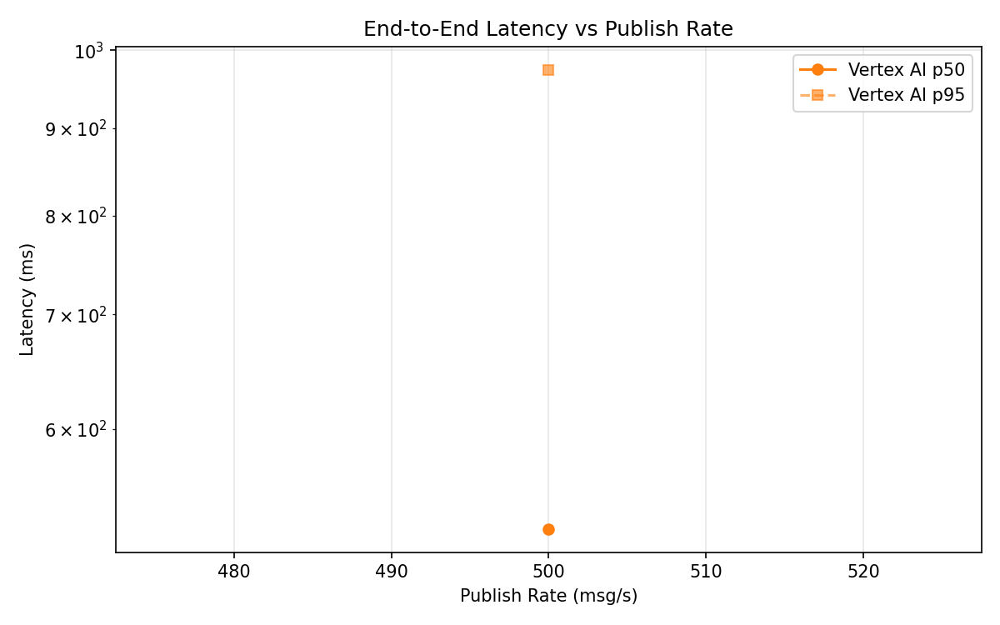
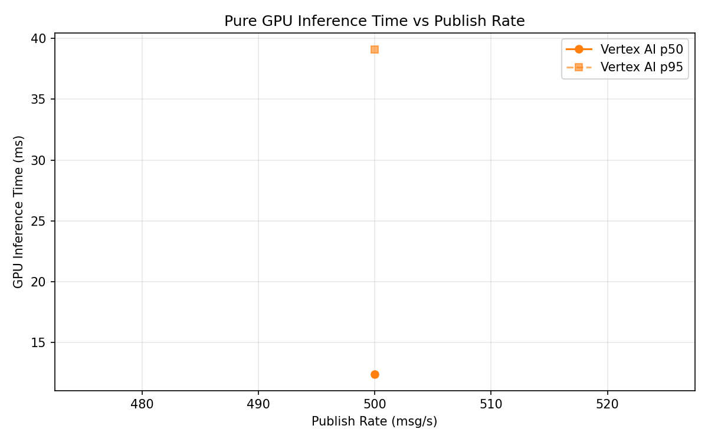
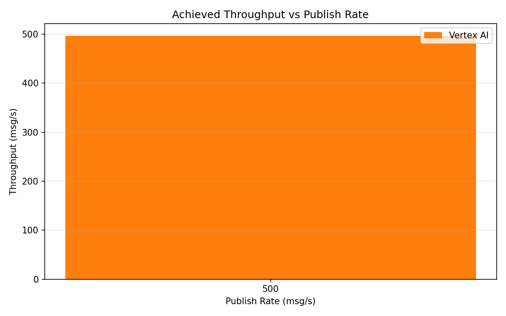

# Benchmark Report

Generated: 2026-03-08 21:43:27

## Configuration

| Parameter | Value |
|---|---|
| Messages per phase | 100s per phase |
| Rates (msg/s) | 500 |
| Experiments | Vertex AI |

## Throughput

| Rate (msg/s) | Vertex AI |
|---|---|
| 500 | 496.8 |

## End-to-End Latency (ms)

| Rate | Percentile | Vertex AI |
|---|---|---|
| 500 | p50 | 524.0 |
| 500 | p95 | 974.0 |
| 500 | p99 | 1288.0 |

## GPU Inference Time (ms)

| Rate | Percentile | Vertex AI |
|---|---|---|
| 500 | p50 | 12.4 |
| 500 | p95 | 39.1 |
| 500 | p99 | 46.6 |

## Charts

### Latency vs Publish Rate

### GPU Inference Time vs Publish Rate

### Throughput vs Publish Rate

