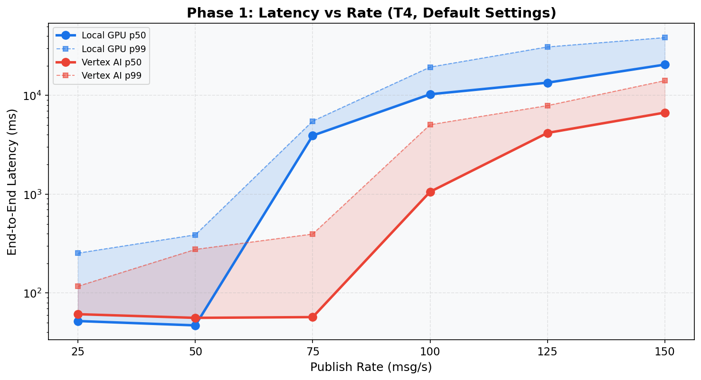
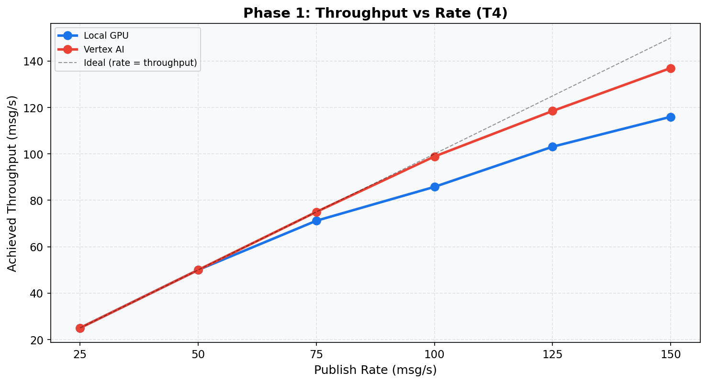

# Phase 1: Baseline Capacity (T4)
[< GPU Summary](gpu_report.md)
## Going In
Single worker, all default settings. The question: **how many msg/s can one worker handle before latency degrades?**
## Configuration
| Parameter | Value | Status |
|---|---|---|
| Local GPU Infrastructure | 1×dataflow:n1s4+t4 | Fixed |
| Vertex AI Infrastructure | 1×dataflow:n1s4 + 1×endpoint:n1s4+t4 | Fixed |
| Model | BERT-base (3-class text classification, max_seq_length=128) | Fixed |
| Region | us-central1 | Fixed |
| Workers | 1 | Default |
| Endpoint Replicas | 1 | Default |
| Harness Threads | 12 | Default |
| max_batch_size | 64 | Default |
| min_batch_size | 1 | Default |
| Publish Rates | 25, 50, 75, 100, 125, 150 msg/s | **Swept** |
| Duration per Rate | 100s | Fixed |

## Results
**Local GPU**
| Rate | Throughput | Latency p50 | p95 | p99 | GPU p50 | GPU p99 |
|---:|---:|---:|---:|---:|---:|---:|
| 25 | 25.0 | 52 ms | 68 ms | 253 ms | 6 ms | 100 ms |
| 50 | 50.0 | 47 ms | 73 ms | 388 ms | 6 ms | 143 ms |
| 75 | 71.2 | 3,920 ms | 5,216 ms | 5,496 ms | 146 ms | 181 ms |
| 100 | 85.8 | 10,265 ms | 18,816 ms | 19,345 ms | 90 ms | 182 ms |
| 125 | 103.1 | 13,444 ms | 25,185 ms | 30,934 ms | 77 ms | 183 ms |
| 150 | 116.0 | 20,492 ms | 36,406 ms | 38,448 ms | 77 ms | 184 ms |

**Vertex AI**
| Rate | Throughput | Latency p50 | p95 | p99 | GPU p50 | GPU p99 |
|---:|---:|---:|---:|---:|---:|---:|
| 25 | 25.0 | 61 ms | 80 ms | 117 ms | 5 ms | 11 ms |
| 50 | 50.0 | 56 ms | 79 ms | 276 ms | 5 ms | 34 ms |
| 75 | 75.0 | 57 ms | 96 ms | 395 ms | 6 ms | 38 ms |
| 100 | 98.9 | 1,057 ms | 4,350 ms | 5,051 ms | 35 ms | 50 ms |
| 125 | 118.5 | 4,170 ms | 7,520 ms | 7,883 ms | 32 ms | 49 ms |
| 150 | 137.0 | 6,696 ms | 13,227 ms | 14,102 ms | 20 ms | 48 ms |

## Conclusion
**Local GPU saturates between 50--75 msg/s** (p50 jumps to 3,920 ms).

**Vertex AI saturates between 75--100 msg/s** (p50 jumps to 1,057 ms).

