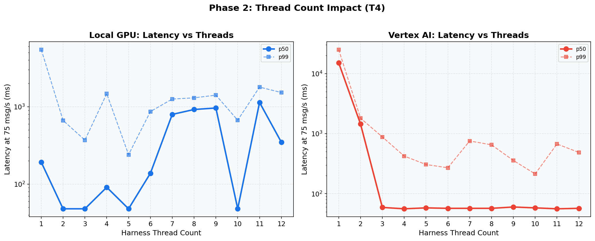
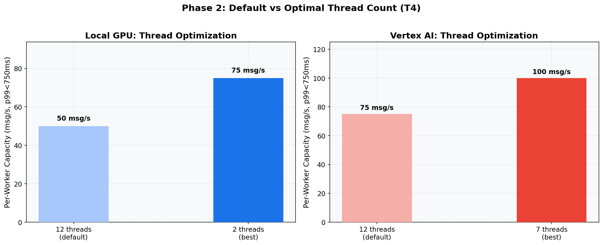

# Phase 2: Thread Count Tuning (T4)
[< GPU Summary](gpu_report.md)
## Going In
Phase 1 showed default 12 harness threads create GPU lock contention for Local GPU (all threads compete for the single GPU) while providing natural HTTP parallelism for Vertex AI. The hypothesis: **fewer threads should reduce lock contention for Local GPU.**
## Configuration
| Parameter | Value | Status |
|---|---|---|
| Local GPU Infrastructure | 1×dataflow:n1s4+t4 | Fixed |
| Vertex AI Infrastructure | 1×dataflow:n1s4 + 1×endpoint:n1s4+t4 | Fixed |
| Model | BERT-base (3-class text classification, max_seq_length=128) | Fixed |
| Region | us-central1 | Fixed |
| Workers | 1 | Default |
| Endpoint Replicas | 1 | Default |
| Harness Threads | **1, 2, 3, 4, 5, 6, 7, 8, 9, 10, 11, 12** | **Swept** |
| max_batch_size | 64 | Default |
| min_batch_size | 1 | Default |
| Publish Rates | varies |  |
| Duration per Rate | 100s | Fixed |

## Results: Latency at 75 msg/s by Thread Count

**Local GPU**
| Threads | Throughput | p50 | p95 | p99 |
|---:|---:|---:|---:|---:|
| 1 | 73.9 | 192 ms | 4,768 ms | 5,458 ms |
| 2 | 74.8 | 48 ms | 131 ms | 664 ms |
| 3 | 75.0 | 48 ms | 98 ms | 370 ms |
| 4 | 75.0 | 91 ms | 974 ms | 1,471 ms |
| 5 | 75.0 | 48 ms | 193 ms | 240 ms |
| 6 | 74.8 | 138 ms | 664 ms | 864 ms |
| 7 | 74.1 | 794 ms | 1,060 ms | 1,254 ms |
| 8 | 74.3 | 919 ms | 1,111 ms | 1,300 ms |
| 9 | 74.4 | 961 ms | 1,178 ms | 1,408 ms |
| 10 | 75.0 | 48 ms | 510 ms | 669 ms |
| 11 | 74.0 | 1,134 ms | 1,540 ms | 1,790 ms |
| 12 | 74.8 | 347 ms | 1,161 ms | 1,522 ms |

**Vertex AI**
| Threads | Throughput | p50 | p95 | p99 |
|---:|---:|---:|---:|---:|
| 1 | 63.0 | 15,110 ms | 24,834 ms | 25,097 ms |
| 2 | 74.1 | 1,447 ms | 1,759 ms | 1,808 ms |
| 3 | 74.9 | 59 ms | 237 ms | 881 ms |
| 4 | 75.0 | 56 ms | 141 ms | 423 ms |
| 5 | 75.0 | 58 ms | 105 ms | 306 ms |
| 6 | 61.9 | 57 ms | 90 ms | 270 ms |
| 7 | 74.9 | 57 ms | 106 ms | 754 ms |
| 8 | 75.0 | 57 ms | 107 ms | 651 ms |
| 9 | 75.0 | 60 ms | 97 ms | 358 ms |
| 10 | 75.0 | 58 ms | 91 ms | 213 ms |
| 11 | 75.0 | 56 ms | 116 ms | 672 ms |
| 12 | 75.0 | 57 ms | 102 ms | 487 ms |

## Conclusion
Thread count has **opposite effects** on the two approaches:

- **Local GPU**: Fewer threads reduce GPU lock contention. With only 2-3 threads, one thread runs inference while the other tokenizes, dramatically improving capacity.
- **Vertex AI**: More threads mean more concurrent HTTP clients. Reducing threads starves the endpoint of work.

**Decision**: Per-experiment thread counts optimized separately.
