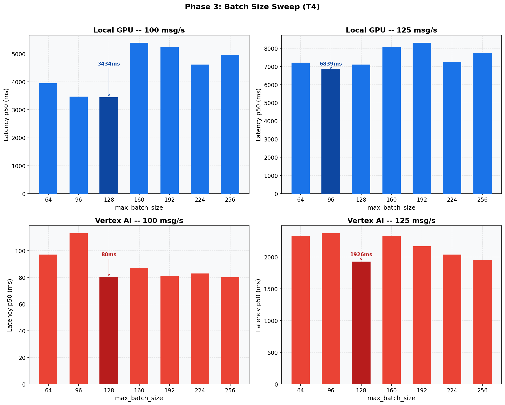

# Phase 3: Batch Size Optimization (T4)
[< GPU Summary](gpu_report.md)
## Going In
Thread counts are fixed from Phase 2. Now we sweep `max_batch_size` -- the max elements RunInference groups per `run_inference()` call.
## Configuration
| Parameter | Value | Status |
|---|---|---|
| Local GPU Infrastructure | 1×dataflow:n1s4+t4 | Fixed |
| Vertex AI Infrastructure | 1×dataflow:n1s4 + 1×endpoint:n1s4+t4 | Fixed |
| Model | BERT-base (3-class text classification, max_seq_length=128) | Fixed |
| Region | us-central1 | Fixed |
| Workers | 1 | Default |
| Endpoint Replicas | 1 | Default |
| Harness Threads | Local GPU=3, Vertex AI=6 | Optimized (Phase 2) |
| max_batch_size | **64, 96, 128, 160, 192, 224, 256** | **Swept** |
| min_batch_size | 1 | Default |
| Publish Rates | varies |  |
| Duration per Rate | 100s | Fixed |

## Results

**Local GPU at 75 msg/s**
| max_batch | Throughput | p50 | p95 | p99 |
|---:|---:|---:|---:|---:|
| 64 | 75.0 | 49 ms | 258 ms | 379 ms |
| 96 | 75.0 | 47 ms | 496 ms | 826 ms |
| 128 | 75.0 | 47 ms | 379 ms | 715 ms |
| 160 | 74.4 | 739 ms | 831 ms | 871 ms |
| 192 | 74.4 | 791 ms | 952 ms | 989 ms |
| 224 | 74.8 | 55 ms | 681 ms | 893 ms |
| 256 | 75.0 | 394 ms | 796 ms | 828 ms |

**Local GPU at 100 msg/s**
| max_batch | Throughput | p50 | p95 | p99 |
|---:|---:|---:|---:|---:|
| 64 | 95.8 | 3,948 ms | 5,105 ms | 5,176 ms |
| 96 | 96.5 | 3,475 ms | 4,027 ms | 4,085 ms |
| 128 | 96.6 | 3,434 ms | 4,247 ms | 4,307 ms |
| 160 | 94.0 | 5,399 ms | 6,687 ms | 6,764 ms |
| 192 | 94.5 | 5,241 ms | 6,175 ms | 6,339 ms |
| 224 | 95.2 | 4,616 ms | 5,456 ms | 5,571 ms |
| 256 | 94.6 | 4,963 ms | 5,725 ms | 5,815 ms |

**Local GPU at 125 msg/s**
| max_batch | Throughput | p50 | p95 | p99 |
|---:|---:|---:|---:|---:|
| 64 | 115.2 | 7,216 ms | 11,872 ms | 12,268 ms |
| 96 | 114.9 | 6,839 ms | 10,890 ms | 11,064 ms |
| 128 | 114.2 | 7,106 ms | 12,827 ms | 13,314 ms |
| 160 | 114.0 | 8,069 ms | 12,350 ms | 12,600 ms |
| 192 | 113.3 | 8,304 ms | 13,222 ms | 13,791 ms |
| 224 | 115.1 | 7,257 ms | 10,497 ms | 10,764 ms |
| 256 | 114.1 | 7,750 ms | 12,430 ms | 12,553 ms |

**Vertex AI at 75 msg/s**
| max_batch | Throughput | p50 | p95 | p99 |
|---:|---:|---:|---:|---:|
| 64 | 75.0 | 59 ms | 109 ms | 503 ms |
| 96 | 75.0 | 55 ms | 112 ms | 1,010 ms |
| 128 | 75.0 | 58 ms | 86 ms | 156 ms |
| 160 | 75.0 | 55 ms | 100 ms | 492 ms |
| 192 | 75.0 | 56 ms | 83 ms | 152 ms |
| 224 | 75.0 | 56 ms | 110 ms | 1,131 ms |
| 256 | 75.0 | 56 ms | 83 ms | 250 ms |

**Vertex AI at 100 msg/s**
| max_batch | Throughput | p50 | p95 | p99 |
|---:|---:|---:|---:|---:|
| 64 | 100.0 | 97 ms | 357 ms | 599 ms |
| 96 | 100.0 | 113 ms | 777 ms | 931 ms |
| 128 | 99.9 | 80 ms | 464 ms | 777 ms |
| 160 | 99.9 | 87 ms | 216 ms | 292 ms |
| 192 | 99.8 | 81 ms | 322 ms | 419 ms |
| 224 | 99.9 | 83 ms | 249 ms | 410 ms |
| 256 | 99.9 | 80 ms | 334 ms | 505 ms |

**Vertex AI at 125 msg/s**
| max_batch | Throughput | p50 | p95 | p99 |
|---:|---:|---:|---:|---:|
| 64 | 121.4 | 2,333 ms | 2,930 ms | 3,001 ms |
| 96 | 122.1 | 2,373 ms | 2,759 ms | 2,854 ms |
| 128 | 122.2 | 1,926 ms | 2,253 ms | 2,317 ms |
| 160 | 122.6 | 2,330 ms | 2,649 ms | 2,709 ms |
| 192 | 122.5 | 2,169 ms | 2,425 ms | 2,493 ms |
| 224 | 122.6 | 2,037 ms | 2,292 ms | 2,412 ms |
| 256 | 122.4 | 1,952 ms | 2,126 ms | 2,174 ms |

## Conclusion
Larger batches amortize GPU kernel overhead (Local GPU) and HTTP round-trip overhead (Vertex AI). The optimal batch size balances throughput gains against accumulation wait time.
