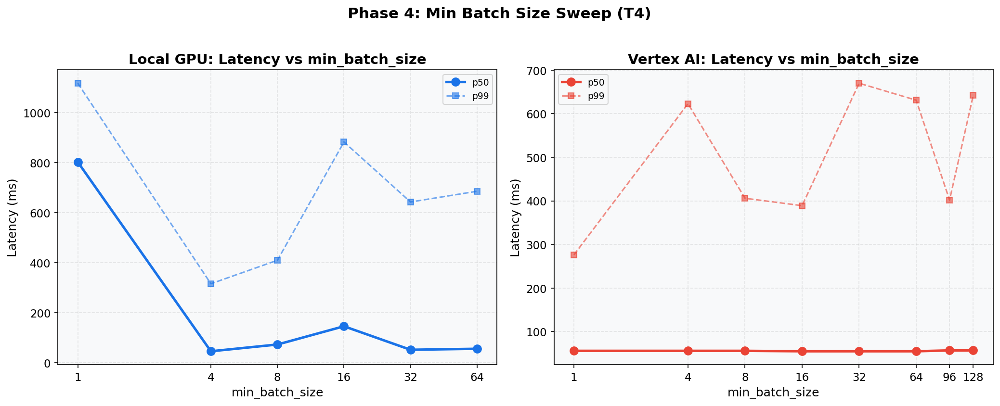

# Phase 4: Min Batch Size (T4)
[< GPU Summary](gpu_report.md)
## Going In
`min_batch_size` controls how long RunInference waits to accumulate elements before calling `run_inference()`. Higher values increase batch efficiency but add wait time.
## Configuration
| Parameter | Value | Status |
|---|---|---|
| Local GPU Infrastructure | 1×dataflow:n1s4+t4 | Fixed |
| Vertex AI Infrastructure | 1×dataflow:n1s4 + 1×endpoint:n1s4+t4 | Fixed |
| Model | BERT-base (3-class text classification, max_seq_length=128) | Fixed |
| Region | us-central1 | Fixed |
| Workers | 1 | Default |
| Endpoint Replicas | 1 | Default |
| Harness Threads | Local GPU=3, Vertex AI=6 | Optimized (Phase 2) |
| max_batch_size | Local GPU=64, Vertex AI=128 | Optimized (Phase 3) |
| min_batch_size | **1, 4, 8, 16, 32, 64, 96, 128** | **Swept** |
| Publish Rates | varies |  |
| Duration per Rate | 100s | Fixed |

## Results

**Local GPU**
| min_batch | Rate | Throughput | p50 | p95 | p99 |
|---:|---:|---:|---:|---:|---:|
| 1 | 75 | 74.5 | 803 ms | 1,080 ms | 1,118 ms |
| 1 | 100 | 93.2 | 5,613 ms | 7,710 ms | 7,944 ms |
| 1 | 125 | 112.9 | 8,884 ms | 14,274 ms | 14,940 ms |
| 4 | 75 | 75.0 | 46 ms | 173 ms | 316 ms |
| 4 | 100 | 97.2 | 2,667 ms | 2,920 ms | 2,975 ms |
| 4 | 125 | 119.2 | 4,856 ms | 5,398 ms | 5,464 ms |
| 8 | 75 | 74.9 | 73 ms | 324 ms | 410 ms |
| 8 | 100 | 96.5 | 3,484 ms | 3,940 ms | 4,035 ms |
| 8 | 125 | 117.5 | 5,788 ms | 6,674 ms | 6,793 ms |
| 16 | 75 | 74.8 | 146 ms | 709 ms | 883 ms |
| 16 | 100 | 96.2 | 3,719 ms | 3,971 ms | 4,046 ms |
| 16 | 125 | 117.9 | 5,804 ms | 6,385 ms | 6,499 ms |
| 32 | 75 | 74.8 | 52 ms | 415 ms | 643 ms |
| 32 | 100 | 96.1 | 3,690 ms | 4,072 ms | 4,141 ms |
| 32 | 125 | 117.5 | 5,663 ms | 6,749 ms | 6,874 ms |
| 64 | 75 | 74.9 | 56 ms | 507 ms | 686 ms |
| 64 | 100 | 96.7 | 3,444 ms | 3,804 ms | 3,859 ms |
| 64 | 125 | 117.4 | 5,868 ms | 6,442 ms | 6,518 ms |

**Vertex AI**
| min_batch | Rate | Throughput | p50 | p95 | p99 |
|---:|---:|---:|---:|---:|---:|
| 1 | 75 | 75.0 | 56 ms | 84 ms | 276 ms |
| 1 | 100 | 99.9 | 122 ms | 677 ms | 899 ms |
| 1 | 125 | 121.3 | 2,052 ms | 3,078 ms | 3,232 ms |
| 4 | 75 | 75.0 | 56 ms | 93 ms | 623 ms |
| 4 | 100 | 99.9 | 81 ms | 252 ms | 422 ms |
| 4 | 125 | 122.8 | 1,804 ms | 1,959 ms | 2,000 ms |
| 8 | 75 | 75.0 | 56 ms | 97 ms | 406 ms |
| 8 | 100 | 100.0 | 85 ms | 696 ms | 979 ms |
| 8 | 125 | 122.8 | 1,813 ms | 1,971 ms | 2,015 ms |
| 16 | 75 | 75.0 | 55 ms | 83 ms | 389 ms |
| 16 | 100 | 99.9 | 88 ms | 209 ms | 262 ms |
| 16 | 125 | 122.7 | 2,098 ms | 2,327 ms | 2,393 ms |
| 32 | 75 | 75.0 | 55 ms | 98 ms | 670 ms |
| 32 | 100 | 100.0 | 109 ms | 526 ms | 646 ms |
| 32 | 125 | 122.6 | 1,821 ms | 1,982 ms | 2,078 ms |
| 64 | 75 | 75.0 | 55 ms | 87 ms | 631 ms |
| 64 | 100 | 99.9 | 89 ms | 478 ms | 713 ms |
| 64 | 125 | 121.9 | 2,151 ms | 2,562 ms | 2,654 ms |
| 96 | 75 | 75.0 | 57 ms | 87 ms | 402 ms |
| 96 | 100 | 100.0 | 78 ms | 193 ms | 373 ms |
| 96 | 125 | 122.7 | 1,803 ms | 1,981 ms | 2,017 ms |
| 128 | 75 | 75.0 | 57 ms | 96 ms | 642 ms |
| 128 | 100 | 99.9 | 82 ms | 432 ms | 722 ms |
| 128 | 125 | 122.8 | 1,679 ms | 1,965 ms | 2,025 ms |

## Conclusion
The `min_batch_size` tradeoff: higher values force batches to fill, which improves GPU utilization but adds queue wait time. The optimal value depends on the incoming message rate.
