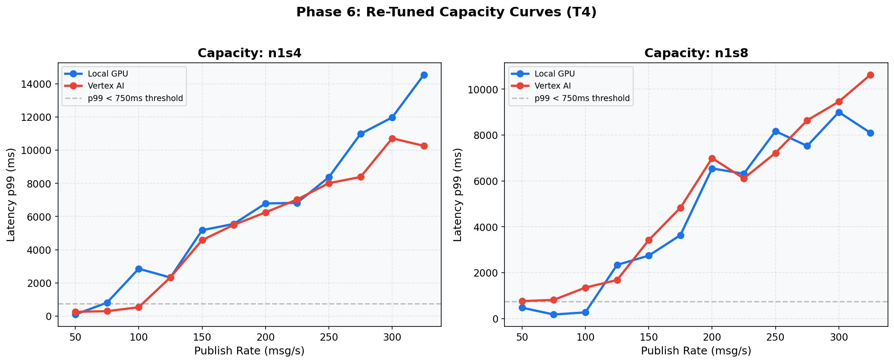
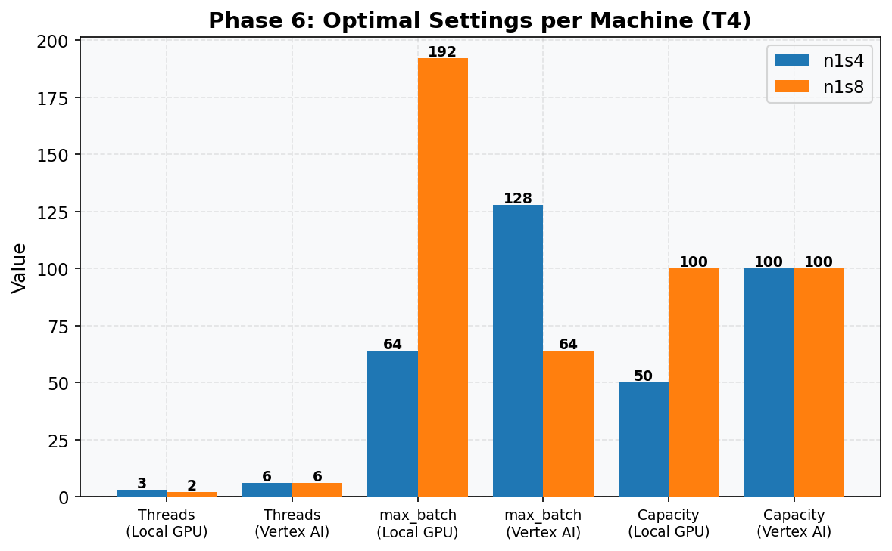

# Phase 6: Re-Tune for Each Machine (T4)
[< GPU Summary](gpu_report.md)
## Going In
Each machine type may have different optimal settings for threads, batch size, and min_batch_size. Phase 6 repeats the thread/batch sweeps for each machine and finds the optimal configuration.
## Configuration
| Parameter | Value | Status |
|---|---|---|
| Local GPU Infrastructure | n1s4, n1s8 | From Phase 5 |
| Vertex AI Infrastructure | n1s4, n1s8 | From Phase 5 |
| Model | BERT-base (3-class text classification, max_seq_length=128) | Fixed |
| Region | us-central1 | Fixed |
| Workers | 1 | Default |
| Endpoint Replicas | 1 | Default |
| Harness Threads | **re-swept per machine** | **Swept** |
| max_batch_size | **re-swept per machine** | **Swept** |
| min_batch_size | **re-swept per machine** | **Swept** |
| Publish Rates | fine-grained capacity sweep | **Swept** |
| Duration per Rate | 100s | Fixed |

## Machine: n1-standard-4
### Optimal Settings
| Setting | Local GPU | Vertex AI |
|---|---|---|
| Threads | 3 | 6 |
| max_batch_size | 64 | 128 |
| min_batch_size | 4 | 64 |
| **Per-Worker Capacity** | **50 msg/s** | **100 msg/s** |

### Capacity Verification
| Experiment | Rate | Throughput | p50 | p99 |
|---|---:|---:|---:|---:|
| Local GPU | 50 | 50.0 | 45 ms | 93 ms |
| Vertex AI | 100 | 99.9 | 79 ms | 530 ms |

## Machine: n1-standard-8
### Optimal Settings
| Setting | Local GPU | Vertex AI |
|---|---|---|
| Threads | 2 | 6 |
| max_batch_size | 192 | 64 |
| min_batch_size | 32 | 16 |
| **Per-Worker Capacity** | **100 msg/s** | **100 msg/s** |

### Capacity Verification
| Experiment | Rate | Throughput | p50 | p99 |
|---|---:|---:|---:|---:|
| Local GPU | 100 | 100.0 | 50 ms | 270 ms |

## Conclusion
Re-tuning for each machine type yields the final per-worker/per-replica capacity numbers used for scaling calculations in Phase 7.
