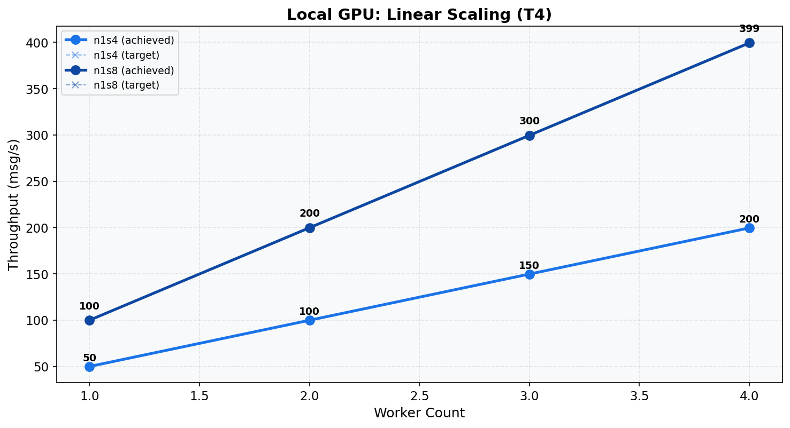
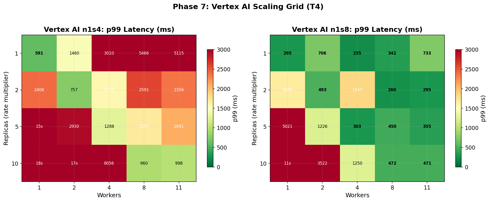

# Phase 7: Scaling Verification (T4)
[< GPU Summary](gpu_report.md)
## Going In
With optimized per-worker settings from Phase 6, we verify scaling: does adding workers deliver proportional throughput? For Vertex AI, we also sweep endpoint replicas.
## Configuration
| Parameter | Value | Status |
|---|---|---|
| Local GPU Infrastructure | n1s4, n1s8 | From Phase 5 |
| Vertex AI Infrastructure | n1s4, n1s8 | From Phase 5 |
| Model | BERT-base (3-class text classification, max_seq_length=128) | Fixed |
| Region | us-central1 | Fixed |
| Workers | **1, 2, 3, 4** | **Swept** |
| Endpoint Replicas | **1, 2, 5, 10** | **Swept** |
| Harness Threads | per-machine optimal | Optimized (Phase 6) |
| max_batch_size | per-machine optimal | Optimized (Phase 6) |
| min_batch_size | per-machine optimal | Optimized (Phase 6) |
| Publish Rates | varies |  |
| Duration per Rate | 100s | Fixed |

## Local GPU Scaling
| Config | Rate | Workers | Throughput | p50 | p99 |
|---|---:|---:|---:|---:|---:|
| n1s4 | 50 | 1 | 50.0 | 46 ms | 235 ms |
| n1s4 | 100 | 2 | 99.9 | 44 ms | 246 ms |
| n1s4 | 150 | 3 | 149.8 | 45 ms | 147 ms |
| n1s4 | 200 | 4 | 199.6 | 48 ms | 309 ms |
| n1s8 | 100 | 1 | 100.0 | 134 ms | 886 ms |
| n1s8 | 200 | 2 | 199.8 | 68 ms | 330 ms |
| n1s8 | 300 | 3 | 299.6 | 68 ms | 603 ms |
| n1s8 | 400 | 4 | 399.4 | 68 ms | 397 ms |

## Vertex AI Scaling
| Config | Rate | Replicas | Workers | Throughput | p50 | p99 |
|---|---:|---:|---:|---:|---:|---:|
| n1s4 | 1000 | 10 | 1 | 883.4 | 7,487 ms | 17,682 ms |
| n1s4 | 1000 | 10 | 11 | 994.8 | 324 ms | 998 ms |
| n1s4 | 1000 | 10 | 2 | 964.5 | 3,740 ms | 17,470 ms |
| n1s4 | 1000 | 10 | 4 | 985.4 | 1,298 ms | 8,056 ms |
| n1s4 | 1000 | 10 | 8 | 994.1 | 411 ms | 960 ms |
| n1s4 | 100 | 1 | 1 | 99.9 | 86 ms | 591 ms |
| n1s4 | 100 | 1 | 11 | 97.8 | 1,587 ms | 5,115 ms |
| n1s4 | 100 | 1 | 2 | 99.3 | 907 ms | 1,460 ms |
| n1s4 | 100 | 1 | 4 | 98.7 | 1,342 ms | 3,010 ms |
| n1s4 | 100 | 1 | 8 | 97.8 | 1,480 ms | 5,466 ms |
| n1s4 | 200 | 2 | 1 | 195.5 | 2,099 ms | 2,406 ms |
| n1s4 | 200 | 2 | 11 | 197.9 | 619 ms | 2,356 ms |
| n1s4 | 200 | 2 | 2 | 199.6 | 211 ms | 757 ms |
| n1s4 | 200 | 2 | 4 | 198.6 | 695 ms | 1,578 ms |
| n1s4 | 200 | 2 | 8 | 198.0 | 505 ms | 2,591 ms |
| n1s4 | 500 | 5 | 1 | 469.9 | 5,418 ms | 14,945 ms |
| n1s4 | 500 | 5 | 11 | 494.6 | 777 ms | 2,091 ms |
| n1s4 | 500 | 5 | 2 | 487.5 | 2,211 ms | 2,930 ms |
| n1s4 | 500 | 5 | 4 | 496.8 | 524 ms | 1,288 ms |
| n1s4 | 500 | 5 | 8 | 495.5 | 662 ms | 1,697 ms |
| n1s8 | 750 | 10 | 1 | 696.3 | 4,742 ms | 11,010 ms |
| n1s8 | 750 | 10 | 11 | 748.8 | 79 ms | 471 ms |
| n1s8 | 750 | 10 | 2 | 728.7 | 2,109 ms | 3,522 ms |
| n1s8 | 750 | 10 | 4 | 742.2 | 780 ms | 1,250 ms |
| n1s8 | 750 | 10 | 8 | 748.7 | 142 ms | 472 ms |
| n1s8 | 75 | 1 | 1 | 75.0 | 57 ms | 295 ms |
| n1s8 | 75 | 1 | 11 | 74.9 | 161 ms | 733 ms |
| n1s8 | 75 | 1 | 2 | 74.8 | 65 ms | 706 ms |
| n1s8 | 75 | 1 | 4 | 75.0 | 71 ms | 235 ms |
| n1s8 | 75 | 1 | 8 | 75.0 | 89 ms | 342 ms |
| n1s8 | 150 | 2 | 1 | 148.6 | 1,243 ms | 1,686 ms |
| n1s8 | 150 | 2 | 11 | 149.9 | 79 ms | 295 ms |
| n1s8 | 150 | 2 | 2 | 149.9 | 59 ms | 493 ms |
| n1s8 | 150 | 2 | 4 | 149.9 | 65 ms | 1,847 ms |
| n1s8 | 150 | 2 | 8 | 149.9 | 71 ms | 260 ms |
| n1s8 | 375 | 5 | 1 | 359.1 | 3,605 ms | 5,021 ms |
| n1s8 | 375 | 5 | 11 | 374.5 | 69 ms | 355 ms |
| n1s8 | 375 | 5 | 2 | 370.6 | 841 ms | 1,226 ms |
| n1s8 | 375 | 5 | 4 | 374.6 | 64 ms | 303 ms |
| n1s8 | 375 | 5 | 8 | 374.4 | 65 ms | 450 ms |

## Conclusion
Local GPU scales linearly: each additional worker adds approximately the per-worker capacity measured in Phase 6.

Vertex AI scaling depends on the ratio of workers to replicas. Too many workers per replica causes endpoint contention; too few wastes capacity.
