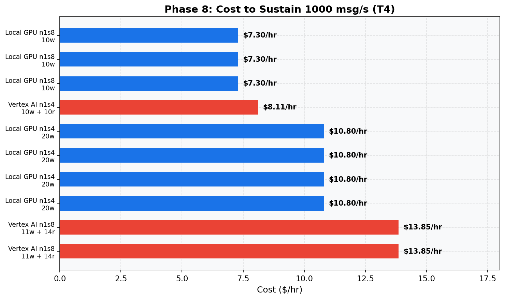
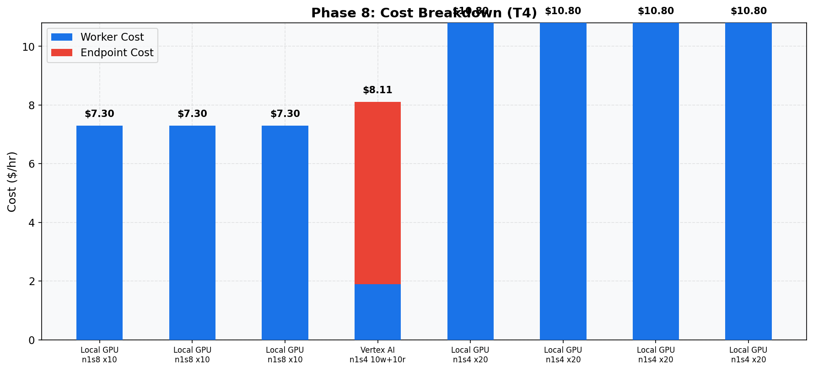

# Phase 8: Cost Analysis (T4)
[< GPU Summary](gpu_report.md)
## Going In
Target: sustain **1000 msg/s** with **p99 < 750ms**. Which configuration is cheapest?
## Configuration
| Parameter | Value | Status |
|---|---|---|
| Local GPU Infrastructure | 1×dataflow:n1s4+t4 | Fixed |
| Vertex AI Infrastructure | 1×dataflow:n1s4 + 1×endpoint:n1s4+t4 | Fixed |
| Model | BERT-base (3-class text classification, max_seq_length=128) | Fixed |
| Region | us-central1 | Fixed |
| Workers | projected from capacity | Projected |
| Endpoint Replicas | projected from capacity | Projected |
| Harness Threads | per-machine optimal | Optimized (Phase 6) |
| max_batch_size | per-machine optimal | Optimized (Phase 6) |
| min_batch_size | per-machine optimal | Optimized (Phase 6) |
| Publish Rates | 1000 msg/s target | Target |
| Duration per Rate | 100s | Fixed |

## Assumptions
- **Projected scaling**: per-worker capacity (tested in Phase 6) is extrapolated to calculate the total workers/replicas needed. Phase 7 verified linear scaling up to the tested worker counts.
- CPU-only Vertex AI workers (GPU is on the endpoint)
- On-demand pricing, us-central1

## Qualifying Configurations (sorted by cost)
| Rank | Experiment | Config | Workers | Replicas | Basis | $/hr | $/M msgs | Breakdown |
|---:|---|---|---:|---:|---|---:|---:|---|
| 1 | Local Gpu | n1s8 | 10 | - | Projected (validated at 2w, 3w, 4w) | $7.30 | $2.03 | 10w × ($0.38 + $0.35) |
| 2 | Vertex Ai | n1s4 endpoint | 10 | 10 | Projected (validated at 1r/1w) | $8.11 | $2.25 | 10w × $0.19 + 10r × ($0.22 + $0.40) |
| 3 | Local Gpu | n1s4 | 20 | - | Projected (validated at 1w, 2w, 3w, 4w) | $10.80 | $3.00 | 20w × ($0.19 + $0.35) |
| 4 | Vertex Ai | n1s8 endpoint | 11 | 14 | Projected (validated at 5r/4w, 10r/8w) | $13.85 | $3.85 | 11w × $0.19 + 14r × ($0.44 + $0.40) |
| 5 | Vertex Ai | n1s8 endpoint | 14 | 14 | Projected (validated at 1r/1w, 2r/2w) | $14.42 | $4.01 | 14w × $0.19 + 14r × ($0.44 + $0.40) |
| 6 | Vertex Ai | n1s8 endpoint | 15 | 14 | Projected (validated at 10r/11w) | $14.61 | $4.06 | 15w × $0.19 + 14r × ($0.44 + $0.40) |
| 7 | Vertex Ai | n1s8 endpoint | 22 | 14 | Projected (validated at 5r/8w) | $15.94 | $4.43 | 22w × $0.19 + 14r × ($0.44 + $0.40) |
| 8 | Vertex Ai | n1s8 endpoint | 27 | 14 | Projected (validated at 1r/2w) | $16.89 | $4.69 | 27w × $0.19 + 14r × ($0.44 + $0.40) |
| 9 | Vertex Ai | n1s8 endpoint | 30 | 14 | Projected (validated at 5r/11w) | $17.46 | $4.85 | 30w × $0.19 + 14r × ($0.44 + $0.40) |
| 10 | Vertex Ai | n1s8 endpoint | 54 | 14 | Projected (validated at 1r/4w, 2r/8w) | $22.02 | $6.12 | 54w × $0.19 + 14r × ($0.44 + $0.40) |
| 11 | Vertex Ai | n1s8 endpoint | 74 | 14 | Projected (validated at 2r/11w) | $25.82 | $7.17 | 74w × $0.19 + 14r × ($0.44 + $0.40) |
| 12 | Vertex Ai | n1s8 endpoint | 107 | 14 | Projected (validated at 1r/8w) | $32.09 | $8.91 | 107w × $0.19 + 14r × ($0.44 + $0.40) |
| 13 | Vertex Ai | n1s8 endpoint | 147 | 14 | Projected (validated at 1r/11w) | $39.69 | $11.02 | 147w × $0.19 + 14r × ($0.44 + $0.40) |

## Conclusion
**Cheapest option: Local Gpu at $7.30/hr** ($2.03 per million messages).

Configuration: 10w × ($0.38 + $0.35)
