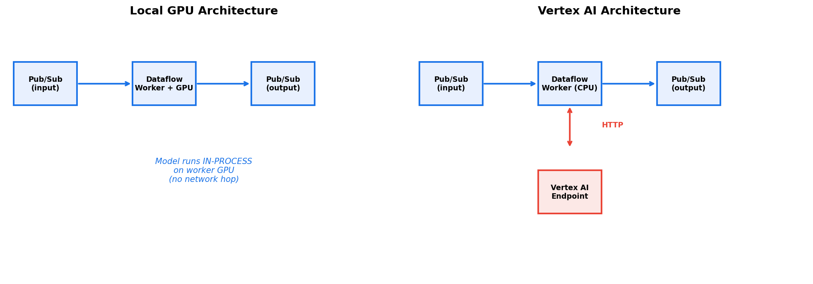
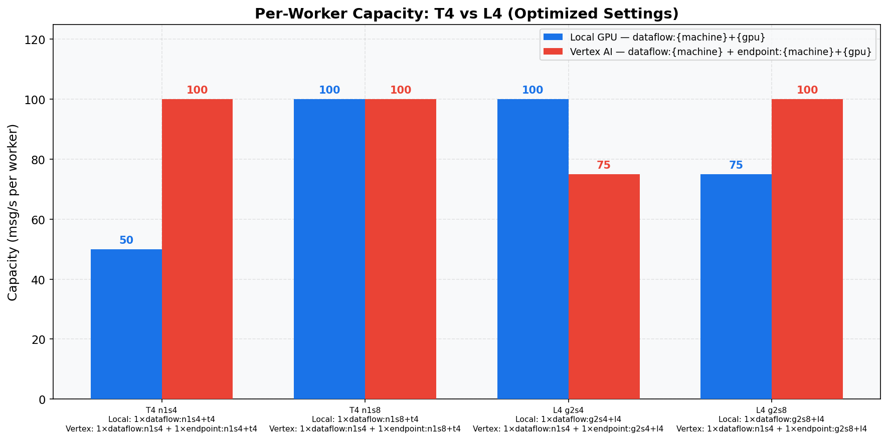
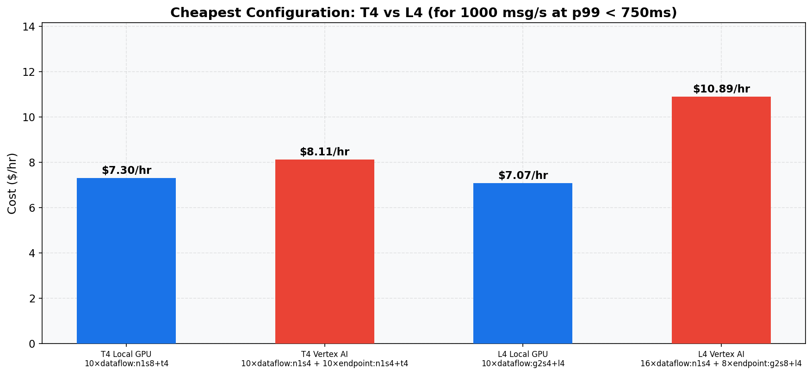

<!--- header table --->
<table>
<tr>     
  <td style="text-align: center">
    <a href="https://github.com/statmike/vertex-ai-mlops/blob/main/data%2Bai/dataflow/gpu/benchmark/reports/benchmark_report.md">
      
       View on GitHub
    </a>
  </td>
</tr>
<tr>
  <td style="text-align: right">
    <b>Share On: </b> 
     
     
     
     
  </td>
</tr>
<tr>
  <td style="text-align: right">
    <b>Connect With Author On: </b> 
    
     
    
     
    
  </td>
</tr>
<tr>
  <td style="text-align: right">
     <a href="https://raw.githubusercontent.com/statmike/vertex-ai-mlops/main/data%2Bai/dataflow/gpu/benchmark/reports/benchmark_report.md">Download File</a> <i>(right-click and "Save As")</i>
  </td>
</tr>
</table>  

---
# GPU Inference Benchmark: Overall Report
## Architecture
Two inference approaches compared under identical conditions:

- **Local GPU**: Model runs directly on each Dataflow worker's GPU. Inference in-process, no network hop.
- **Vertex AI**: Workers send HTTP prediction requests to a Vertex AI endpoint. Model runs on separate managed infrastructure.

## Methodology
An 8-phase systematic capacity planning study to find the cheapest infrastructure that sustains **1000 msg/s at p99 < 750ms**:

1. **Baseline Capacity** -- single worker, default settings, rate sweep to find saturation
2. **Thread Tuning** -- sweep harness threads (1-12) per experiment
3. **Batch Size** -- sweep max_batch_size to optimize throughput
4. **Min Batch Size** -- tune accumulation wait tradeoff
5. **Machine Sweep** -- compare worker machine types
6. **Re-Tune** -- optimize settings per machine type
7. **Scaling** -- verify linear scaling with multiple workers
8. **Cost Analysis** -- find cheapest config for 1000 msg/s at p99 < 750ms

## Cross-GPU Comparison
| Metric | T4 n1s4 | T4 n1s8 | L4 g2s4 | L4 g2s8 |
|---|---|---|---|---|
| **Local GPU Infrastructure** | 1×dataflow:n1s4+t4 | 1×dataflow:n1s8+t4 | 1×dataflow:g2s4+l4 | 1×dataflow:g2s8+l4 |
| **Vertex AI Infrastructure** | 1×dataflow:n1s4 + 1×endpoint:n1s4+t4 | 1×dataflow:n1s4 + 1×endpoint:n1s8+t4 | 1×dataflow:n1s4 + 1×endpoint:g2s4+l4 | 1×dataflow:n1s4 + 1×endpoint:g2s8+l4 |
| Local GPU Capacity | 50 msg/s | 100 msg/s | 100 msg/s | 75 msg/s |
| Vertex AI Capacity | 100 msg/s | 100 msg/s | 75 msg/s | 100 msg/s |
| Local GPU Threads | 3 | 2 | 2 | 2 |
| Vertex AI Threads | 6 | 6 | 7 | 9 |
| Local GPU max_batch | 64 | 192 | 256 | 224 |
| Vertex AI max_batch | 128 | 64 | 96 | 160 |
| Local GPU min_batch | 4 | 32 | 8 | 192 |
| Vertex AI min_batch | 64 | 16 | 32 | 1 |

## Recommendation
**T4**: Cheapest to sustain 1000 msg/s at p99 < 750ms = **$7.30/hr** (`10×dataflow:n1s8+t4`)

**L4**: Cheapest to sustain 1000 msg/s at p99 < 750ms = **$7.07/hr** (`10×dataflow:g2s4+l4`)

## Future Work
Areas that could add value in a follow-up benchmark using the same GPU types and machine families:

1. **Full-scale validation** -- Run at the actual 1000 msg/s target to confirm projections hold. Phase 7 tested up to ~750 msg/s; the final cost numbers extrapolate from there assuming linear scaling continues.
2. **Longer duration tests** -- Each rate was tested for 100 seconds, enough to find the saturation knee but not long enough to reveal memory leaks, GC pauses, or throughput drift that may emerge over 10--30 minute sustained runs.
3. **Finer rate granularity near saturation** -- Phases used 25 msg/s increments. Sweeping at 5--10 msg/s steps around each saturation knee (e.g. 60--90 msg/s for T4 Local GPU) would sharpen capacity numbers.
4. **Sequence length sensitivity** -- All tests used `max_seq_length=128`. Longer inputs increase GPU compute per item and would shift the optimal batch size, thread count, and per-worker capacity.
5. **Model optimization** -- TensorRT, ONNX Runtime, or `torch.compile()` could substantially change GPU inference throughput without any pipeline tuning changes, potentially improving per-worker capacity.
6. **Worker-to-replica ratio sweep** -- Phase 7 tested a grid of replica and worker counts for Vertex AI. A more systematic sweep of the ratio (e.g. 1:1, 2:1, 3:1 workers per replica) at larger scale could identify the most cost-efficient balance.

### Scaling Flexibility and Variable Rates
This benchmark tested steady-state throughput at fixed worker and replica counts. A dedicated follow-up study could test how well each approach handles real-world dynamics:

- **Variable and bursty traffic** -- Real workloads are not constant-rate. Testing with step changes, sinusoidal ramps, or Poisson-distributed arrivals would show how well each approach absorbs traffic spikes.
- **Cold start and warm-up latency** -- How long does a newly added Dataflow worker or Vertex AI replica take to reach steady-state throughput? This matters for autoscaling responsiveness.
- **Autoscaling behavior** -- Testing with Dataflow autoscaling enabled (and Vertex AI autoscaling for the endpoint) would measure scale-up/down lag, over-provisioning costs, and whether the system can self-right under load changes.

## GPU Reports
- [T4 GPU Report](../data/runs/t4_full/reports/gpu_report.md)
- [L4 GPU Report](../data/runs/l4_full/reports/gpu_report.md)
