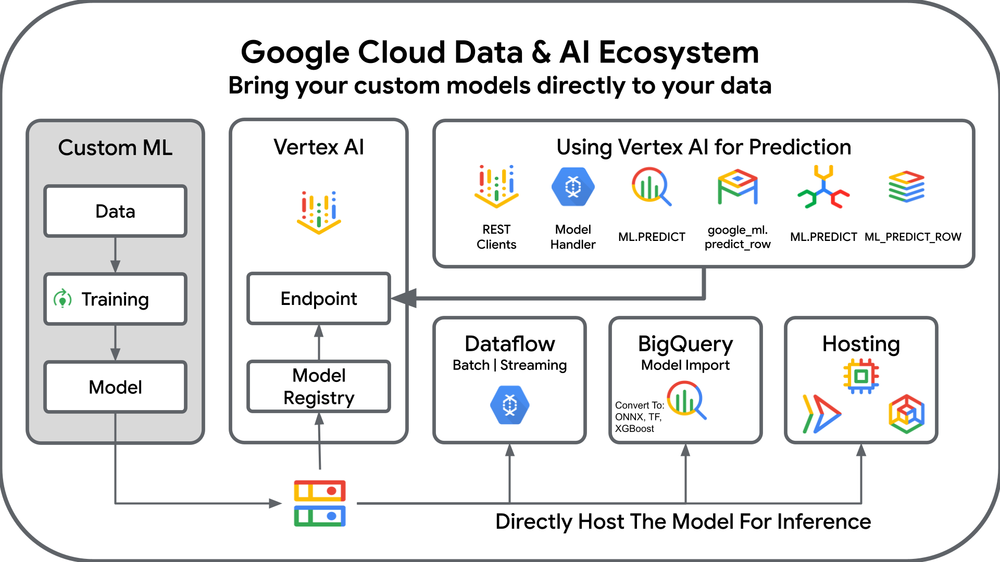

<!--- header table --->
<table>
<tr>     
  <td style="text-align: center">
    <a href="https://github.com/statmike/vertex-ai-mlops/blob/main/data%2Bai/readme.md">
      
       View on GitHub
    </a>
  </td>
</tr>
<tr>
  <td style="text-align: right">
    <b>Share On: </b> 
     
     
     
     
  </td>
</tr>
<tr>
  <td style="text-align: right">
    <b>Connect With Author On: </b> 
    
     
    
     
    
  </td>
</tr>
</table>  

---
# Data + AI: Machine Learning with Google Cloud Data Sources

This guide provides an overview of machine learning options when working with data sources in Google Cloud. Whether you're building custom ML models or leveraging pre-trained solutions, Google Cloud offers a comprehensive ecosystem that brings your models directly to your data.

## Google Cloud Database Solutions

Google Cloud offers a comprehensive portfolio of fully managed database services designed to meet diverse application needs. From transactional workloads to analytical processing, each database service provides unique capabilities for storing and managing your data.

**[View the complete guide to Google Cloud Databases →](gcs-databases.md)**

The guide covers:
- **Google Cloud Storage (GCS)** - Object storage for unstructured data, blobs, and backups
- **BigQuery** - Serverless data warehouse for large-scale SQL analytics
- **Cloud SQL** - Managed relational databases (MySQL, PostgreSQL, SQL Server)
- **AlloyDB for PostgreSQL** - High-performance PostgreSQL with AI integration
- **Cloud Spanner** - Globally distributed, strongly consistent relational database
- **Cloud Bigtable** - NoSQL wide-column store for large-scale, low-latency applications
- **Firestore** - NoSQL document database for mobile and web applications
- **Memorystore** - In-memory data store for Redis and Memcached

Each database service offers native integration with Google Cloud's AI and ML ecosystem, enabling you to build intelligent applications that combine data storage, processing, and machine learning.

## Serving Custom ML Models

Google Cloud provides multiple pathways for serving custom machine learning models, allowing you to bring your models directly to your data regardless of where they're stored or how they were trained.

### Model Deployment Options

You can deploy custom ML models to Google Cloud through several approaches:

1. **Custom ML Training** - Train your models using your preferred framework and data sources
2. **Vertex AI** - Deploy models to managed endpoints with automatic scaling and monitoring
3. **Bring Your Own Model** - Import models trained elsewhere into Vertex AI Model Registry
4. **Database-Native ML** - Execute predictions directly within your database using SQL

### The Google Cloud Data & AI Ecosystem

*Bring your custom models directly to your data*

## PyTorch Model Training & Serving Examples

The following table provides a comprehensive guide to training custom PyTorch models and deploying them across various Google Cloud services. Each deployment option is tailored for specific use cases, from managed endpoints to database-native predictions.

### Complete Workflow Matrix

| Training | Deployment System | Method | Notebooks & Guides |
|----------|-------------------|--------|-------------------|
| **[PyTorch Autoencoder](../Framework%20Workflows/PyTorch/pytorch-autoencoder.ipynb)**  Custom PyTorch model for anomaly detection • Data from BigQuery • Custom preprocessing layers • Multiple save formats (.pt, TorchScript, .mar) | **Vertex AI Endpoints**  Managed online prediction service | Pre-built Container (TorchServe) | [Pre-built Container Deployment](../Framework%20Workflows/PyTorch/serving/vertex-ai-endpoint-prebuilt-container.ipynb) • Quick deployment with TorchServe • Returns full model output (13 metrics) • Auto-scaling, built-in monitoring |
| | | Custom Container (FastAPI) | [Custom Container Deployment](../Framework%20Workflows/PyTorch/serving/vertex-ai-endpoint-custom-container.ipynb) • ~70% response size reduction • Custom output formatting • Complete control over API |
| | **BigQuery ML**  SQL-based inference in data warehouse | ONNX Import (Native) | [ONNX Import to BigQuery](../Framework%20Workflows/PyTorch/serving/bigquery-bqml-import-model-onnx.ipynb) • Model runs natively in BigQuery • Lower latency, no endpoint costs • Best for models < 250 MB |
| | | Remote Model (Vertex AI) | [Remote Model from BigQuery](../Framework%20Workflows/PyTorch/serving/bigquery-bqml-remote-model-vertex.ipynb) • Call Vertex AI endpoints from SQL • No size limits • Batch scoring with `ML.PREDICT()` |
| | **AlloyDB AI**  PostgreSQL-compatible transactional database | Vertex AI Endpoint (SQL) | [AlloyDB with Vertex AI](../Framework%20Workflows/PyTorch/serving/alloydb-vertex-ai-endpoint.ipynb) • OLTP + ML in one database • `google_ml.predict_row()` function • Sub-millisecond queries + predictions |
| | **Cloud Spanner**  Globally distributed relational database | Vertex AI Endpoint (SQL) | [Spanner with Vertex AI](../Framework%20Workflows/PyTorch/serving/spanner-vertex-ai-endpoint.ipynb) • Global scale with strong consistency • `ML.PREDICT()` in GoogleSQL • 99.999% SLA (multi-region) |
| | **Dataflow RunInference**  Batch and streaming processing | Local Model (Batch) | [Setup](../Framework%20Workflows/PyTorch/serving/dataflow-setup.ipynb) • [Batch Processing](../Framework%20Workflows/PyTorch/serving/dataflow-batch-runinference.ipynb) • [Cleanup](../Framework%20Workflows/PyTorch/serving/dataflow-cleanup.ipynb) • Process BigQuery tables • In-process inference • Cost-effective for large datasets |
| | | Local Model (Streaming) | [Streaming Processing](../Framework%20Workflows/PyTorch/serving/dataflow-streaming-runinference.ipynb) • Process Pub/Sub streams • Explicit BatchElements + custom DoFn • Auto-scaling workers |
| | | Local Model (Streaming Keyed) | [Streaming with KeyedModelHandler](../Framework%20Workflows/PyTorch/serving/dataflow-streaming-runinference-keyed.ipynb) • Beam-native RunInference + KeyedModelHandler • 5 pipeline steps (vs 7 explicit) • Model tracking via `PredictionResult.model_id` |
| | | Local Model (Streaming Keyed + Event-Mode) | [Streaming with Model Hot-Swap](../Framework%20Workflows/PyTorch/serving/dataflow-streaming-runinference-keyed-event-mode.ipynb) • Runtime model hot-swap via Pub/Sub • Vertex AI Model Registry integration • Rollback by publishing previous version path |
| | | Vertex Endpoint (Batch) | [Batch with Vertex API](../Framework%20Workflows/PyTorch/serving/dataflow-batch-runinference-vertex.ipynb) • Call endpoint for BigQuery data • Managed model updates • Separation of compute and serving |
| | | Vertex Endpoint (Streaming) | [Streaming with Vertex API](../Framework%20Workflows/PyTorch/serving/dataflow-streaming-runinference-vertex.ipynb) • Call endpoint for Pub/Sub data • Real-time with managed endpoints • Version control and A/B testing |
| | **TorchServe**  Self-managed PyTorch model server | Local Testing | [Local TorchServe](../Framework%20Workflows/PyTorch/serving/torchserve-local.ipynb) • Test before deployment • Debug .mar files • Validate handlers |
| | | Cloud Run (Serverless) | [Cloud Run Deployment](../Framework%20Workflows/PyTorch/serving/torchserve-cloud-run.ipynb) • Serverless auto-scaling • Pay per request • Zero infrastructure management |
| | | Compute Engine (VMs) | [GCE Guide](../Framework%20Workflows/PyTorch/serving/torchserve-gce.md) • Full VM control • Custom configurations • Persistent infrastructure |
| | | Kubernetes (GKE) | [GKE Guide](../Framework%20Workflows/PyTorch/serving/torchserve-gke.md) • Container orchestration • Advanced scaling policies • Multi-model deployment |

### Additional Resources

- **[Serving Overview](../Framework%20Workflows/PyTorch/serving/readme.md)** - Detailed comparison of all deployment options
- **[Advanced Topics](../Framework%20Workflows/PyTorch/serving/advanced-topics.md)** - Scaling, GPUs, and performance optimization
- **[PyTorch Framework Guide](../Framework%20Workflows/PyTorch/readme.md)** - Complete PyTorch workflow documentation

### TO BE ADDED

- Training Options: Vertex, BQML
- Solutions
- Generative AI - Hosted Models
- Generative AI - Private Models

