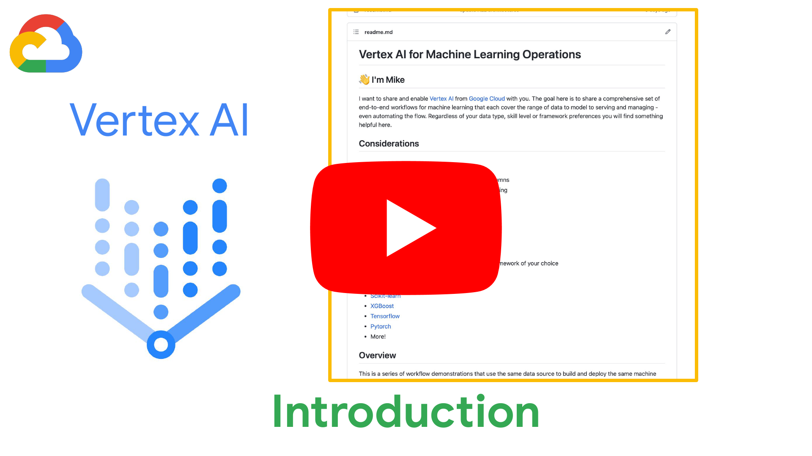
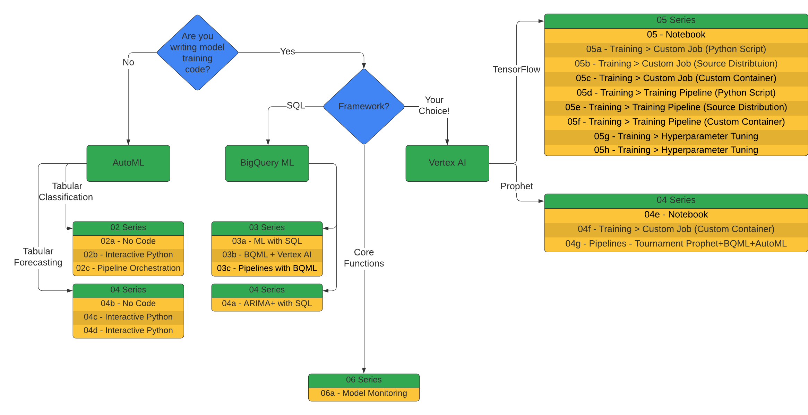
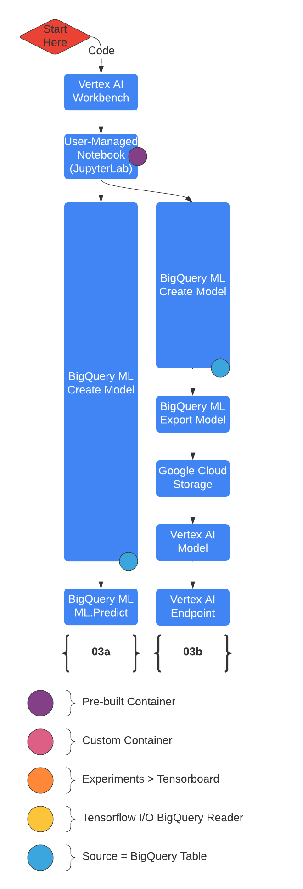
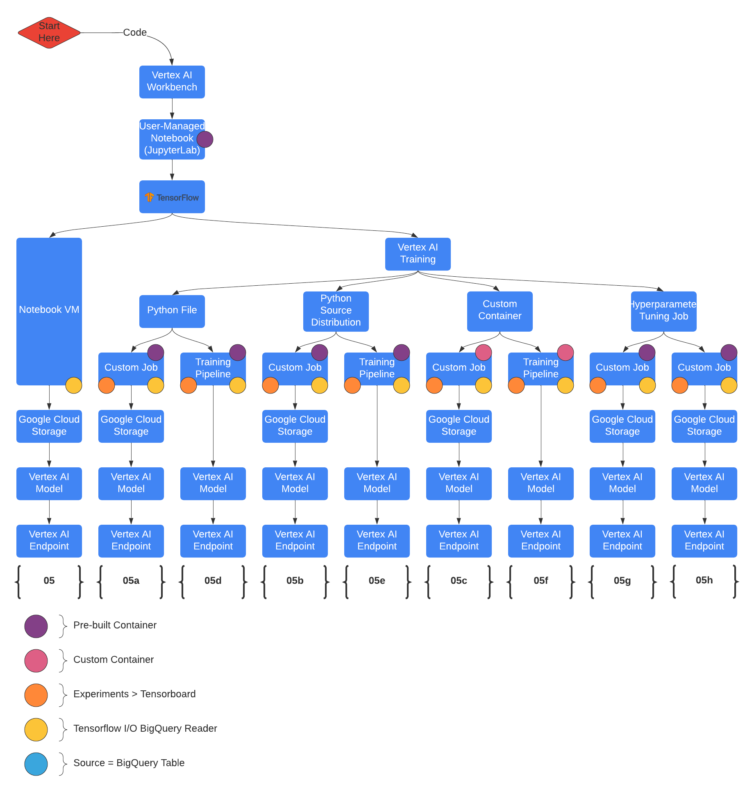
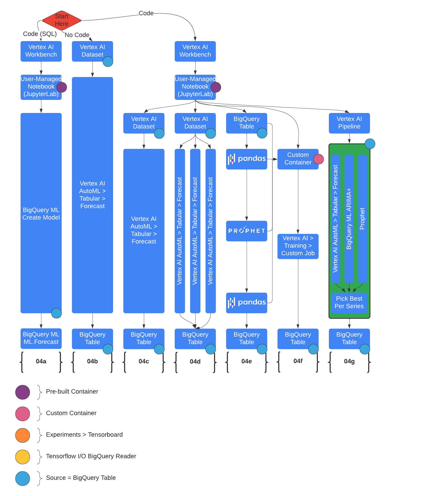
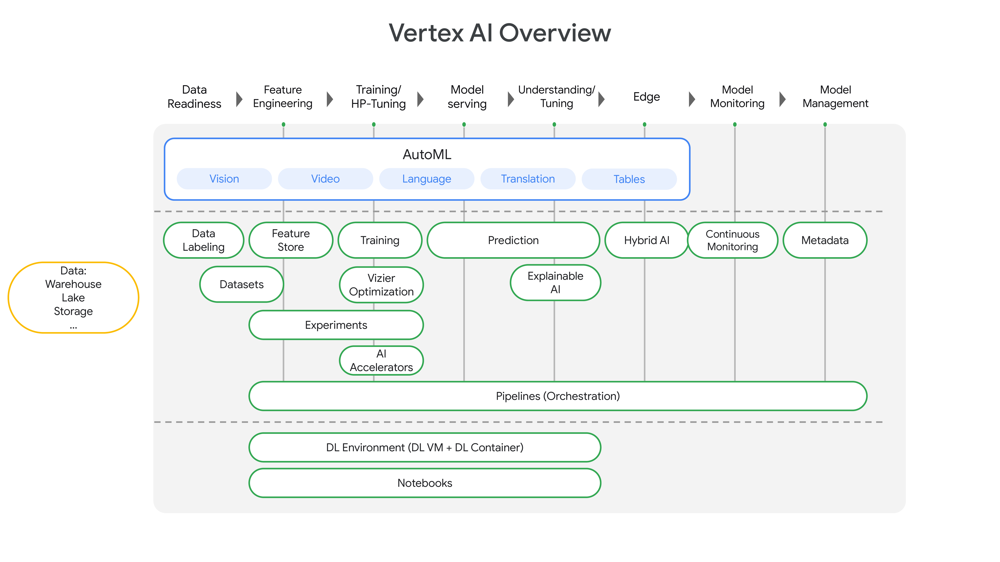
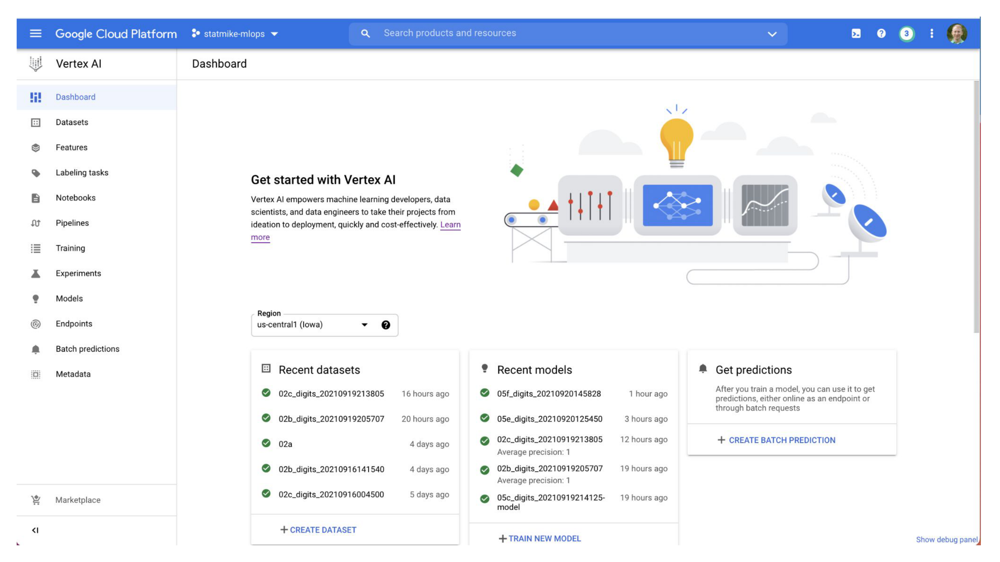

# Vertex AI for Machine Learning Operations

## 👋 I'm Mike

I want to share and enable [Vertex AI](https://cloud.google.com/vertex-ai/docs/start/introduction-unified-platform) from [Google Cloud](https://cloud.google.com/vertex-ai) with you.  The goal here is to share a comprehensive set of end-to-end workflows for machine learning that each cover the range of data to model to serving and managing - even automating the flow.  Regardless of your data type, skill level or framework preferences you will find something helpful here. 

   <a href="https://youtu.be/snUEwsft1wY" target="_blank" rel="noopener noreferrer">
      <kbd></kbd>
   </a>

Click to watch on YouTube

Click <a href="https://youtube.com/playlist?list=PLgxF613RsGoUuEjJJxJW2JYyZ8g1qOUou" target="_blank" rel="noopener noreferrer">here</a> to see full playlist for this repository

## Considerations

### Data Type

-  Tables: Tabular, structured data in rows and columns
-  Language: Text for translation and/or understanding
-  Vision: Images
-  Video

### Convenience Level

-  Use Pre-Trained APIs
-  Automate building Custom Models
-  End-to-end Custom ML with core tools in the framework of your choice

### Framework Preferences

-  [Scikit-learn](https://scikit-learn.org/stable/index.html)
-  [XGBoost](https://xgboost.readthedocs.io/en/latest/)
-  [Tensorflow](https://www.tensorflow.org/)
-  [Pytorch](https://pytorch.org/)
-  [Spark MLlib](https://spark.apache.org/docs/latest/ml-guide.html)
-  [R](https://www.r-project.org/)
-  [Julia](https://julialang.org/)
-  More!

## Overview

This is a series of workflow demonstrations that use the same data source to build and deploy the same machine learning model with different frameworks and automation.  These are meant to help get started in understanding and learning Vertex AI and provide starting points for new projects.  

The demonstrations focus on workflows and don't delve into the specifics of ML frameworks other than how to integrate and automate with Vertex AI. Let me know if you have ideas for more workflows or details to include!

To understand the contents of this repository, the following charts uncover the groupings of the content.

| Direction |
:-------------------------:

This work focuses on cases where you have training date:

| Overview |
:-------------------------:

|AutoML|BigQuery ML|Vertex AI| Forecasting with AutoML, BigQuery ML, OSS Prophet |
:---:|:---:|:---:|:---:
|||

## Vetex AI

Vetex AI is a platform for end-to-end model development.  It consist of core components that make the processes of MLOps possible for design patterns of all types.

  
&nbsp; &nbsp; &nbsp; &nbsp;
  

## Setup

The demonstrations are presented in a series of JupyterLab notebooks. These can be reviewed directly in [this repository on GitHub](https://github.com/statmike/vertex-ai-mlops) or cloned to your Jupyter instance on [Vertex AI Workbench](https://cloud.google.com/vertex-ai/docs/workbench/notebook-solution).

### Option 1: Review files directly

Select the files and review them directly in the browser or IDE of your choice.  This can be helpful for general understanding and selecting sections to copy/paste to your project.

### Option 2: Run These Notebooks in a Vertex AI Workbench based Notebook 

1. Create a Project
   1. [Link](https://console.cloud.google.com/cloud-resource-manager), Alternatively, go to: Console > IAM & Admin > Manage Resources
   1. Click "+ Create Project"
   1. Provide: name, billing account, organization, location
   1. Click "Create"
1. Enable the APIs: Vertex AI API and Notebooks API
   1. [Link](https://console.cloud.google.com/flows/enableapi?apiid=aiplatform.googleapis.com,notebooks.googleapis.com)
      1. Alternatively, go to: 
         1. Console > Vertex AI, then enable API
         1. Then Console > Vertex AI > Workbench, then enable API
1. Create A Notebook
   1. [Link](https://console.cloud.google.com/vertex-ai/workbench), Alternatively, go to: Console > Vertex AI > Workbench
   1. Click User-Managed Notebooks
   1. Click "+ Create Notebook" or "+ New Notebook"
   1. Selections:
      1. Tensorflow Enterprise > Tensorflow Enterprise 2.3 > Without GPUs
      1. Provide: name, region = us-central1, machine type = n1-standard-4
      1. some options may be under "Advanced Options"
   1. Click "Create"
1. Open JupyterLab Notebook Instance
   1. Once the Notebook Instance is started click the "Open JupyterLab" link
   1. Clone This Repository to the Notebook Instance
      1. Use the Git Menu at the top or on the left navigation bar to select "Clone a Repository"
      1. Provide the Clone URI of this repository: [https://github.com/statmike/vertex-ai-mlops.git](https://github.com/statmike/vertex-ai-mlops.git)
      1. In the File Browser you will now have the folder "vertex-ai-mlops" that contains the files from this repository
1. Setup the Notebook Environment for these workflows
   1. Open the notebook vertex-ai-mlops/00 - Environment Setup
   1. Follow the instructions and run the cells

Resources on these items:
- [Google Cloud Projects](https://cloud.google.com/resource-manager/docs/creating-managing-projects)
- [Vertex AI environment](https://cloud.google.com/vertex-ai/docs/start/cloud-environment)
- [Introduction to Notebooks](https://cloud.google.com/notebooks/docs/introduction)
- [Create a Notebooks Instance](https://cloud.google.com/notebooks/docs/create-new)
- [Open Notebooks](https://cloud.google.com/notebooks/docs/create-new#open_the_notebook_2)

## Learning Machine Learning
I often get asked "How do I learn about ML?".  There are lots of good answers.  I do have a preferred answer that is offered here.  I believe in a broad understanding of the topic, terminology, problem framing and method selection while also building up fundamental understandings of how everything actually works.  
1. Good overview with terminology, methods, problem framing, and tips for using APIs from TensorFlow.  The [Machine Learning Crash Course](https://developers.google.com/machine-learning/crash-course)
2. Strong Introduction to Fundamentals with Andrew Ng offered by Stanford on Coursera.  [Machine Learning](https://www.coursera.org/learn/machine-learning)
3. Pull it all together with excellent walk-throughs of the core concepts from the [Youtube channel 3Blue1Brown](https://www.youtube.com/c/3blue1brown)
   1. [Neural Networks](https://www.youtube.com/playlist?list=PLZHQObOWTQDNU6R1_67000Dx_ZCJB-3pi) playlist
   2. [Essence of linear algebra](https://www.youtube.com/playlist?list=PLZHQObOWTQDPD3MizzM2xVFitgF8hE_ab) playlist
   3. [Essence of calculus](https://www.youtube.com/playlist?list=PLZHQObOWTQDMsr9K-rj53DwVRMYO3t5Yr) playlist

This is a good review order: 1, 3.1, 3.2, 3.3, 2, 3.1 (again!).  When done with this, remember you are a beginner so begin, have fun, make mistakes and keep optimizing your cost function to boost your knowledge!

A good next step is to use the [curriculums curated by the Tensorflow community](https://www.tensorflow.org/resources/learn-ml).  These are great at balancing coding, math & stats, theory, and project based learning.

## More Resources Like This Repository

This is my personal repository of demonstrations I use for learning and sharing Vertex AI.  There are many more resources available.  Within each notebook I have included a resources section and a related training section. 

- GitHub [GoogleCloudPlatform/vertex-ai-samples](https://github.com/GoogleCloudPlatform/vertex-ai-samples)
- GitHub [GoogleCloudPlatform/mlops-with-vertex-ai](https://github.com/GoogleCloudPlatform/mlops-with-vertex-ai)
- [Overview of Data Science on Google Cloud](https://cloud.google.com/data-science)