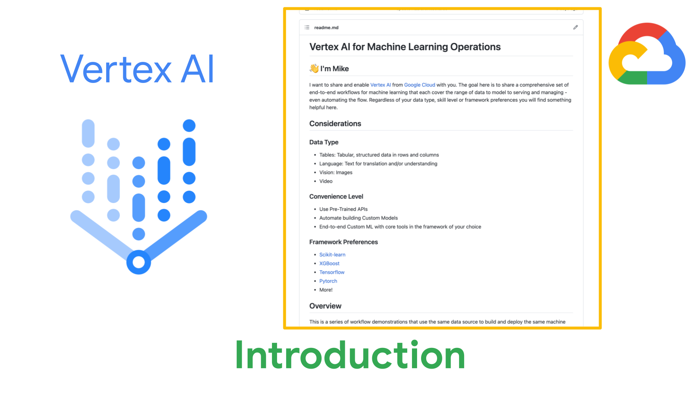
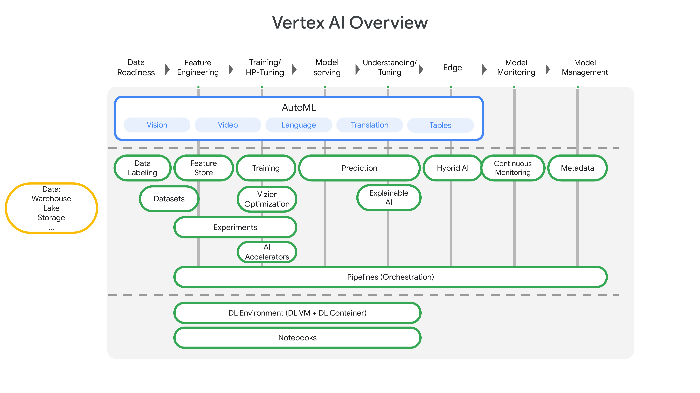

# Vertex AI for Machine Learning Operations

## 👋 I'm Mike

I want to share and enable [Vertex AI](https://cloud.google.com/vertex-ai/docs/start/introduction-unified-platform) from [Google Cloud](https://cloud.google.com/vertex-ai) with you.  The goal here is to share a comprehensive set of end-to-end workflows for machine learning that each cover the range of data to model to serving and managing - even automating the flow.  Regardless of your data type, skill level or framework preferences you will find something helpful here. 

## Considerations

### Data Type

-  Tables: Tabular, structured data in rows and columns
-  Language: Text for translation and/or understanding
-  Vision: Images
-  Video

### Convenience Level

-  Use Pre-Trained APIs
-  Automate building Custom Models
-  End-to-end Custom ML with core tools in the framework of your choice

### Framework Preferences

-  [Scikit-learn](https://scikit-learn.org/stable/index.html)
-  [XGBoost](https://xgboost.readthedocs.io/en/latest/)
-  [Tensorflow](https://www.tensorflow.org/)
-  [Pytorch](https://pytorch.org/)
-  More!

## Overview

This is a series of workflow demonstrations that use the same data source to build and deploy the same machine learning model with different levels of skill and automation.  These are meant to help get started in understanding and learning Vertex AI and provide starting points for new projects.  

The demonstrations focus on workflows and don't delve into the specifics of ML frameworks other than how to integrate and automate with Vertex AI. Let me know if you have ideas for more workflows or details to include!

   

## Vetex AI

Vetex AI is a platform for end-to-end model development.  It consist of core components that make the processes of MLOps possible for design patterns of all types.

## Setup

The demonstrations are presented in a series of JupyterLab notebooks. These can be reviewed directly in [this repository on GitHub](https://github.com/statmike/vertex-ai-mlops) or cloned to your Jupyter instance.

### Option 1: Review files directly

Select the files and review them directly.  This can be helpful for general understanding and selecting sections to copy/paste to your project.

### Option 2: Clone the repository

1. Create a notebook instance in Vertex AI
   1. [Introduction to Notebooks](https://cloud.google.com/notebooks/docs/introduction) - pre-installed suites of ML software with selectable machine types (CPUs and RAM) and accelerators (GPUs)
   1. [Create a Notebooks Instance](https://cloud.google.com/notebooks/docs/create-new) (JupyterLab)
      1. Recommended settings for this repository:
         1. Tensorflow 2.3 without GPUs
         1. Machine type of n1-standard-4

1. [Open ](https://cloud.google.com/notebooks/docs/create-new#open_the_notebook_2)JupyterLab for your notebooks instance
   1. In the Git menu, select "Clone a Repository"
   1. Provide the Clone URI of this repository: [https://github.com/statmike/vertex-ai-mlops.git](https://github.com/statmike/vertex-ai-mlops.git)
   1. In the File Browser you will now have the folder "vertex-ai-mlops" that contains the files from this repository

## More Resources Like This

This is my personal repository of demonstrations I use for learning and sharing Vertex AI.  There are many more resources available.  Within each notebook I have included a resources section and a related training section. 

-  GitHub [GoogleCloudPlatform/vertex-ai-samples](https://github.com/GoogleCloudPlatform/vertex-ai-samples)
