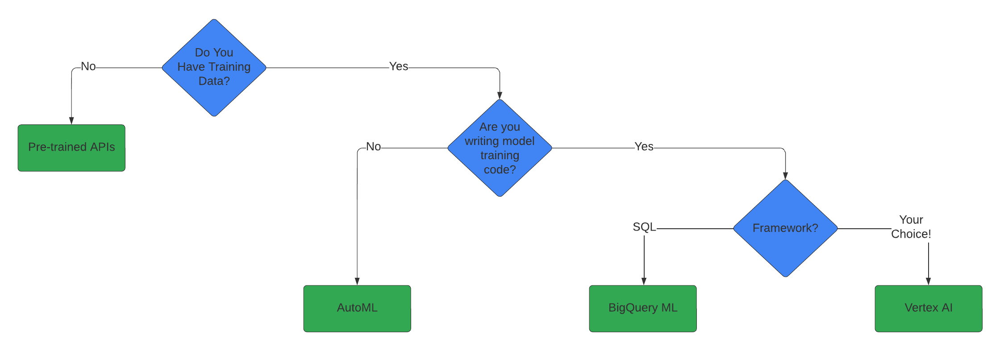
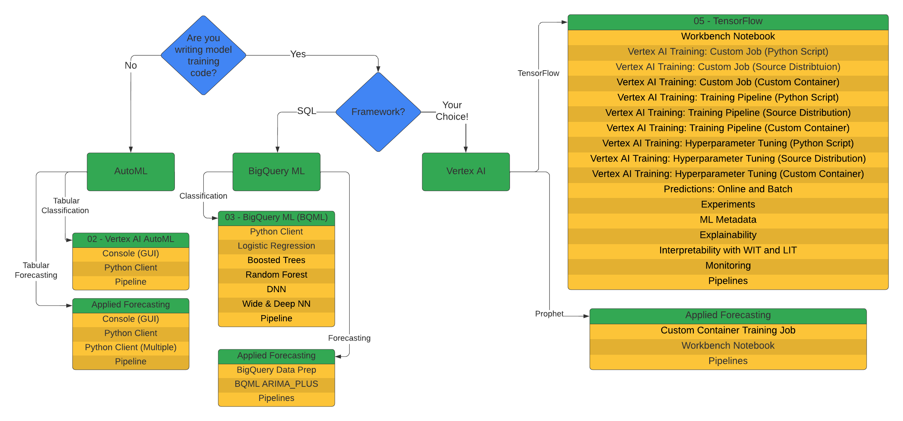
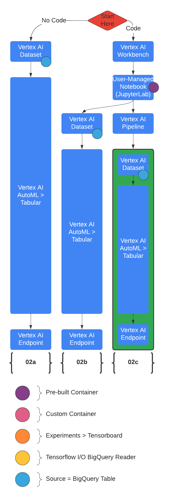
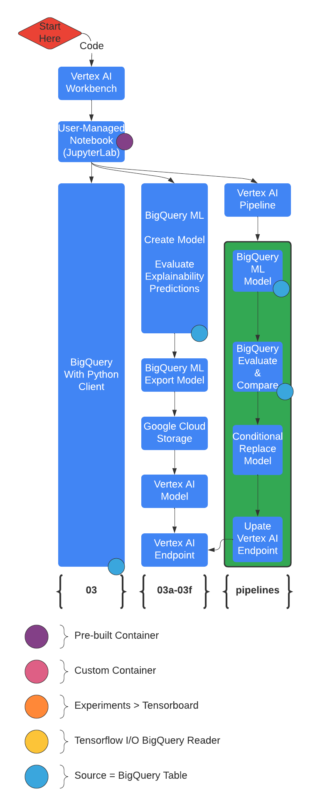
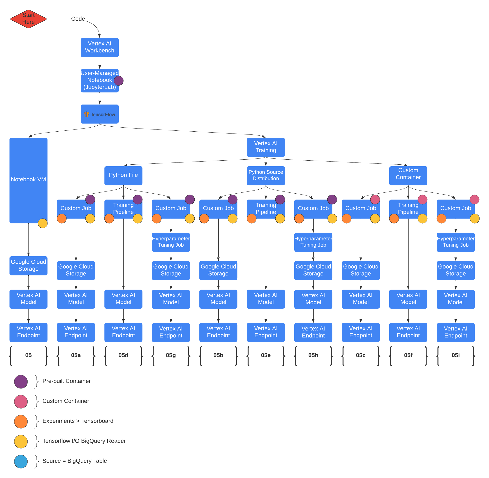
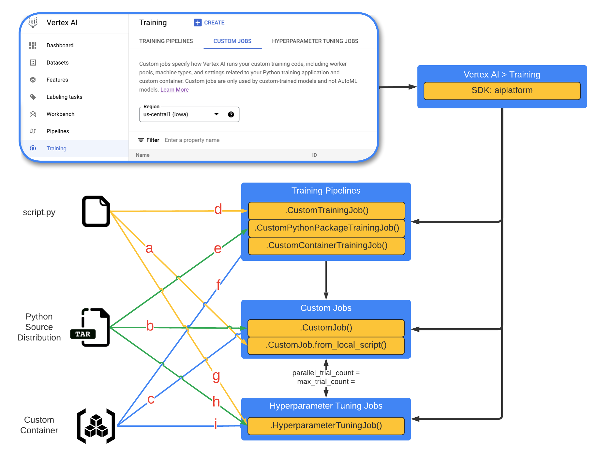
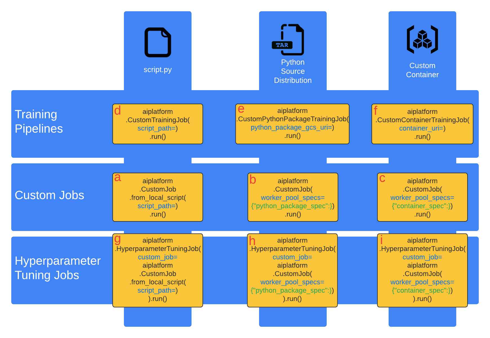

<p align="center" width="100%">
    
</p>

# Vertex AI for Machine Learning Operations

## 👋 I'm Mike

I want to share and enable [Vertex AI](https://cloud.google.com/vertex-ai/docs/start/introduction-unified-platform) from [Google Cloud](https://cloud.google.com/vertex-ai) with you.  The goal here is to share a comprehensive set of end-to-end workflows for machine learning that each cover the range of data to model to serving and managing - even automating the flow.  Regardless of your data type, skill level or framework preferences you will find something helpful here. 

<p align="center" width="100%">
    <a href="https://youtu.be/snUEwsft1wY" target="_blank" rel="noopener noreferrer">
      <kbd></kbd>
    </a>
</p>
<p align="center">Click to watch on YouTube</p>
<p align="center">Click <a href="https://youtube.com/playlist?list=PLgxF613RsGoUuEjJJxJW2JYyZ8g1qOUou" target="_blank" rel="noopener noreferrer">here</a> to see current playlist for this repository</p>

---
## Tracking

To better understand which content is most helpful to users this repository uses tracking pixels in each markdown (.md) and notebook (.ipynb) file.  No user or location information gets captured as this is set to use a dummy client and session of 1 to protect privacy.  The only information captured is that the content was rendered/viewed which gives us a daily count of usage.  Please share any concerns you have with this in [repositories discussion board](https://github.com/statmike/vertex-ai-mlops/discussions) and I am happy to also provide a branch without tracking.

---
## Table of Contents
- [Considerations](#considerations)
- [Overview](#overview)
- [Vertex AI](#vertex)
- [Interacting With Vertex AI](#vertexsdk)
- [Setup](#setup)
- [Helpful Sections](#helpful)
- [More Resources](#resources)

---
<a id = 'considerations'></a>
## Considerations

### Data Type

-  Tables: Tabular, structured data in rows and columns
-  Language: Text for translation and/or understanding
-  Vision: Images
-  Video

### Convenience Level

-  Use Pre-Trained APIs
-  Automate building Custom Models
-  End-to-end Custom ML with core tools in the framework of your choice

### Framework Preferences

-  [Scikit-learn](https://scikit-learn.org/stable/index.html)
-  [XGBoost](https://xgboost.readthedocs.io/en/latest/)
-  [Tensorflow](https://www.tensorflow.org/)
-  [Pytorch](https://pytorch.org/)
-  [Spark MLlib](https://spark.apache.org/docs/latest/ml-guide.html)
-  [R](https://www.r-project.org/)
-  [Julia](https://julialang.org/)
-  More!

---
<a id = 'overview'></a>
## Overview

This is a series of workflow demonstrations that use the same data source to build and deploy the same machine learning model with different frameworks and automation.  These are meant to help get started in understanding and learning Vertex AI and provide starting points for new projects.  

The demonstrations focus on workflows and don't delve into the specifics of ML frameworks other than how to integrate and automate with Vertex AI. Let me know if you have ideas for more workflows or details to include!

To understand the contents of this repository, the following charts uncover the groupings of the content.

| Direction |
:-------------------------:


### Pre-Trained APIs
<table style='text-align:center;vertical-align:middle' width="100%" cellpadding="1" cellspacing="0">
    <tr>
        <th colspan='4'>Pre-Trained Models</th>
        <th rowspan='2'>
            
            <a href="https://cloud.google.com/vertex-ai/docs/beginner/beginners-guide" target="_blank">AutoML</a>
        </th>
    </tr>
    <tr>
        <th>Data Type</th>
        <th>Pre-Trained Model</th>
        <th>Prediction Types</th>
        <th>Related Solutions</th>
    </tr>
    <tr>
        <td rowspan='2'>
            
            <br>Text
        </td>
        <td>
            
            <br><a href="https://cloud.google.com/translate/docs/overview" target="_blank">Cloud Translation API</a>
        </td>
        <td>Detect, Translate</td>
        <td>
            
            <br><a href="https://cloud.google.com/text-to-speech/docs/basics" target="_blank">Cloud Text-to-Speech</a>
        </td>
        <td>
            
            <br><a href="https://cloud.google.com/translate/automl/docs" target="_blank">AutoML Translation</a>
        </td>
    </tr>
            <tr>
                <td>
                   
                   <br><a href="https://cloud.google.com/natural-language/docs/quickstarts" target="_blank">Cloud Natural Language API</a>
                </td>
                <td>
                    Entities (Identify and label), Sentiment, Entity Sentiment, Syntax, Content Classification
                </td>
                <td>
                    
                    <br><a href="https://cloud.google.com/healthcare-api/docs/how-tos/nlp" target="_blank">Healthceare Natural Language API</a>
                </td>
                <td>
                    
                    <br><a href="https://cloud.google.com/vertex-ai/docs/training-overview#text_data" target="_blank">AutoML Text</a>
            </tr>
    <tr>
        <td>
            
            <br>Image
        </td>
        <td>
            
            <br><a href="https://cloud.google.com/vision/docs/features-list" target="_blank">Cloud Vision API</a>
        </td>
        <td>
            Crop Hint, OCR, Face Detect, Image Properties, Label Detect, Landmark Detect, Logo Detect, Object Localization, Safe Search, Web Detect
        </td>
        <td>
            
            <br><a href="https://cloud.google.com/document-ai/docs/processors-list" target="_blank">Document AI</a>
        </td>
        <td>
            
            <br><a href="https://cloud.google.com/vertex-ai/docs/training-overview#image_data" target="_blank">AutoML Image</a>
        </td>
    </tr>
    <tr>
        <td>
            
            <br>Audio
        </td>
        <td>
            
            <br><a href="https://cloud.google.com/media-translation" target="_blank">Cloud Media Translation API</a>
        </td>
        <td>Real-time speech translation</td>
        <td>
            
            <br><a href="https://cloud.google.com/speech-to-text/docs/basics" target="_blank">Cloud Speech-to-Text</a>
        </td>
        <td></td>
    </tr>
    <tr>
        <td>
            
            <br>Video
        </td>
        <td>
            
            <br><a href="https://cloud.google.com/video-intelligence/docs/quickstarts" target="_blank">Cloud Video Intelligence API</a>
        </td>
        <td>
            Label Detect*, Shot Detect*, Explicit Content Detect*, Speech Transcription, Object Tracking*, Text Detect, Logo Detect, Face Detect, Person Detect, Celebrity Recognition
        </td>
        <td></td>
        <td>
            
            <br><a href="https://cloud.google.com/vertex-ai/docs/training-overview#video_data" target="_blank">AutoML Video</a>
        </td>
    </tr>
</table>


### AutoML
<table style='text-align:center;vertical-align:middle' width="100%" cellpadding="1" cellspacing="0">
    <tr>
        <th colspan='3'>AutoML</th>
    </tr>
    <tr>
        <th>Data Type</th>
        <th>
            
            <br><a href="https://cloud.google.com/vertex-ai/docs/beginner/beginners-guide" target="_blank">AutoML</a>
        </th>
        <th>Prediction Types</th>
    </tr>
    <tr>
        <td>
            
            <br>Table
        </td>
        <td>
            
            <br><a href="https://cloud.google.com/vertex-ai/docs/training-overview#tabular_data" target="_blank">AutoML Tables</a>
        </td>
        <td>
            <dl>
                <dt>Classification</dt>
                    <dd>Binary</dd>
                    <dd>Multi-class</dd>
                <dt>Regression</dt>
                <dt>Forecasting</dt>
            </dl>
        </td>
    </tr>
    <tr>
        <td>
            
            <br>Image
        </td>
        <td>
            
            <br><a href="https://cloud.google.com/vertex-ai/docs/training-overview#image_data" target="_blank">AutoML Image</a>
        </td>
        <td>
            <dl>
                <dt>Classification</dt>
                    <dd>Single-label</dd>
                    <dd>Multi-label</dd>
                <dt>Object Detection</dt>
            </dl>
        </td>
    </tr>
    <tr>
        <td>
            
            <br>Video
        </td>
        <td>
            
            <br><a href="https://cloud.google.com/vertex-ai/docs/training-overview#video_data" target="_blank">AutoML Video</a>
        </td>
        <td>
            <dl>
                <dt>Classification</dt>
                <dt>Object Detection</dt>
                <dt>Action Recognition</dt>
            </dl>
        </td>
    </tr>
    <tr>
        <td>
            
            <br>Text
        </td>
        <td>
            
            <br><a href="https://cloud.google.com/vertex-ai/docs/training-overview#text_data" target="_blank">AutoML Text</a>
        </td>
        <td>
            <dl>
                <dt>Classification</dt>
                    <dd>Single-label</dd>
                    <dd>Multi-label</dd>
                <dt>Entity Extraction</dt>
                <dt>Sentiment Analysis</dt>
            </dl>
        </td>
    </tr>
    <tr>
        <td>
            
            <br>Text
        </td>
        <td>
            
            <br><a href="https://cloud.google.com/translate/automl/docs" target="_blank">AutoML Translation</a>
        </td>
        <td>
            Translation
        </td>
    </tr>
</table>

### With Training Data

This work focuses on cases where you have training data:

| Overview |
:-------------------------:


|AutoML|BigQuery ML|Vertex AI| Forecasting with AutoML, BigQuery ML, OSS Prophet |
:---:|:---:|:---:|:---:
|||

### Vertex AI For ML Training

<p align="center" width="100%">
    
    &nbsp; &nbsp; &nbsp; &nbsp;
    
</p>

---
<a id = 'vertex'></a>
## Vetex AI

Vetex AI is a platform for end-to-end model development.  It consist of core components that make the processes of MLOps possible for design patterns of all types.

<p align="center">
  
&nbsp; &nbsp; &nbsp; &nbsp;
  
</p>

---
<a id = 'vertexsdk'></a>
## Interacting with Vertex AI
Many Vertex AI resources can be viewed and monitored directly in the [GCP Console](https://console.cloud.google.com/vertex-ai).  Vertex AI resources are primarily created, and modified with the [Vertex AI API](https://cloud.google.com/vertex-ai/docs/reference).  

The API is accessible from:
- the command line with [`gcloud ai`](https://cloud.google.com/sdk/gcloud/reference/ai), 
- [REST](https://cloud.google.com/vertex-ai/docs/reference/rest),
- [gRPC](https://cloud.google.com/vertex-ai/docs/reference/rpc), 
- or the [client libraries](https://cloud.google.com/vertex-ai/docs/start/client-libraries) (built on top of gRPC) for
    - [Python](https://cloud.google.com/python/docs/reference/aiplatform/latest), 
    - [Java](https://cloud.google.com/java/docs/reference/google-cloud-aiplatform/latest/overview), and 
    - [Node.js](https://cloud.google.com/nodejs/docs/reference/aiplatform/latest).  

The notebooks in this repository primarily use the Python client `aiplatform`.  There is occasional use of `aiplatform.gapic`,  `aiplatform_v1` and `aiplatform_v1beta1`.

For the full details on the APIs versions and layers and how/when to use each, [see this helpful note](./Tips/aiplatform_notes.md).

**Install the Vertex AI Python Client**
```python
pip install google-cloud-aiplatform
```

**Example Usage: Listing all Model in Vertex AI Model Registry**
```python
PROJECT = 'statmike-mlops-349915'
REGION = 'us-central1'

# List all models for project in region with: aiplatform
from google.cloud import aiplatform
aiplatform.init(project = PROJECT, location = REGION)

model_list = aiplatform.Model.list()
```

---
<a id = 'setup'></a>
## Setup

The demonstrations are presented in a series of JupyterLab notebooks. These can be reviewed directly in [this repository on GitHub](https://github.com/statmike/vertex-ai-mlops) or cloned to your Jupyter instance on [Vertex AI Workbench](https://cloud.google.com/vertex-ai/docs/workbench/notebook-solution).

### Option 1: Review files directly

Select the files and review them directly in the browser or IDE of your choice.  This can be helpful for general understanding and selecting sections to copy/paste to your project.

### Option 2: Run These Notebooks in a Vertex AI Workbench based Notebook 

TL;DR
> In Google Cloud Console, Select/Create a Project then go to Vertex AI > Workbench > User-Managed Notebooks
> - Create a new notebook and Open JupyterLab
> - Clone this repository using Git Menu, Open and run `00 - Environment Setup.ipynb`

1. Create a Project
   1. [Link](https://console.cloud.google.com/cloud-resource-manager), Alternatively, go to: Console > IAM & Admin > Manage Resources
   1. Click "+ Create Project"
   1. Provide: name, billing account, organization, location
   1. Click "Create"
1. Enable the APIs: Vertex AI API and Notebooks API
   1. [Link](https://console.cloud.google.com/flows/enableapi?apiid=aiplatform.googleapis.com,notebooks.googleapis.com)
      1. Alternatively, go to: 
         1. Console > Vertex AI, then enable API
         1. Then Console > Vertex AI > Workbench, then enable API
1. Create A Notebook
   1. [Link](https://console.cloud.google.com/vertex-ai/workbench), Alternatively, go to: Console > Vertex AI > Workbench
   1. Click User-Managed Notebooks
   1. Click "+ Create Notebook" or "+ New Notebook"
   1. Selections:
      1. Tensorflow Enterprise > Tensorflow Enterprise 2.3 > Without GPUs
      1. Provide: name, region = us-central1, machine type = n1-standard-4
      1. some options may be under "Advanced Options"
   1. Click "Create"
1. Open JupyterLab Notebook Instance
   1. Once the Notebook Instance is started click the "Open JupyterLab" link
   1. Clone This Repository to the Notebook Instance
      1. Use the Git Menu at the top or on the left navigation bar to select "Clone a Repository"
      1. Provide the Clone URI of this repository: [https://github.com/statmike/vertex-ai-mlops.git](https://github.com/statmike/vertex-ai-mlops.git)
      1. In the File Browser you will now have the folder "vertex-ai-mlops" that contains the files from this repository
1. Setup the Notebook Environment for these workflows
   1. Open the notebook vertex-ai-mlops/00 - Environment Setup
   1. Follow the instructions and run the cells

Resources on these items:
- [Google Cloud Projects](https://cloud.google.com/resource-manager/docs/creating-managing-projects)
- [Vertex AI environment](https://cloud.google.com/vertex-ai/docs/start/cloud-environment)
- [Introduction to Notebooks](https://cloud.google.com/notebooks/docs/introduction)
- [Create a Notebooks Instance](https://cloud.google.com/notebooks/docs/create-new)
- [Open Notebooks](https://cloud.google.com/notebooks/docs/create-new#open_the_notebook_2)

---
<a id = 'helpful'></a>
## Helpful Sections
- [Learning Machine Learning](./Learn%20ML/readme.md)
    - I often get asked "How do I learn about ML?".  There are lots of good answers. ....
- [Explorations](./Explorations/readme.md)
    - This is a series of projects for exploring new, new-to-me, and emerging tools in the ML world!
- [Tips](./Tips/readme.md)
    - Tips for using the repository and notebooks with examples of core skills like building containers, parameterizing jobs and interacting with other GCP services. These tips help with scaling jobs and developing them with a focus on CI/CD.

---
<a id = 'resources'></a>
## More Resources Like This Repository

This is my personal repository of demonstrations I use for learning and sharing Vertex AI.  There are many more resources available.  Within each notebook I have included a resources section and a related training section. 

- GitHub [GoogleCloudPlatform/vertex-ai-samples](https://github.com/GoogleCloudPlatform/vertex-ai-samples)
- GitHub [GoogleCloudPlatform/mlops-with-vertex-ai](https://github.com/GoogleCloudPlatform/mlops-with-vertex-ai)
- [Overview of Data Science on Google Cloud](https://cloud.google.com/data-science)

---
## ToDo

See individual todo list in the readme within each folder of the repository 
- [ ] for each notebook add a list of api's, roles, perimission used
- [ ] use virtualenv throughout
- [ ] move all setup of apis into the 00 folder and reference them as prerequisites
