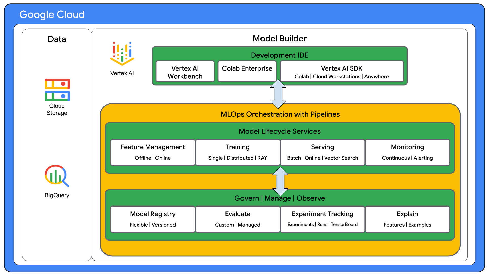

<!--- header table --->
<table>
<tr>     
  <td style="text-align: center">
    <a href="https://github.com/statmike/vertex-ai-mlops/blob/main/readme.md">
      
       View on GitHub
    </a>
  </td>
</tr>
<tr>
  <td style="text-align: right">
    <b>Share On: </b> 
     
     
     
     
  </td>
</tr>
<tr>
  <td style="text-align: right">
    <b>Connect With Author On: </b> 
    
     
    
     
    
  </td>
</tr>
<tr>
  <td style="text-align: right">
     <a href="https://raw.githubusercontent.com/statmike/vertex-ai-mlops/main/readme.md">Download File</a> <i>(right-click and "Save As")</i>
  </td>
</tr>
</table>  

---
# MLOps on GCP

Google Cloud's AI platform has evolved through several names — **Cloud ML Engine**, then **AI Platform**, then **Vertex AI**, and as of April 2026, **[Gemini Enterprise Agent Platform](https://cloud.google.com/blog/products/ai-machine-learning/introducing-gemini-enterprise-agent-platform)**. Each renaming reflects an expansion in scope: from custom model training, to a unified ML platform with AutoML and managed notebooks, to the current vision that brings together model building, agent development, orchestration, and governance in a single platform. This repository has tracked that evolution, and its recent content — AI agents with ADK, agent deployment on Agent Engine (formerly Vertex AI Agent Builder), and agentic workflows — reflects exactly where the platform is heading.

While the AI platform is the anchor, this repository reaches across the broader Google Cloud ecosystem. You'll find workflows that integrate BigQuery and BigQuery ML for in-database analytics and AI functions, Dataflow (Apache Beam) and Dataproc (Managed Apache Spark) for batch and streaming inference, Cloud Composer (Airflow) for orchestration, and Cloud Run and GKE for model serving. Database services — Spanner, AlloyDB, Cloud SQL, Memorystore, Firestore, and Bigtable — appear throughout as feature stores, vector search backends, and SQL-based inference endpoints. The goal is to show how these services work together in real ML and AI workflows, not just in isolation.

A comprehensive collection of **470+ interactive notebooks** covering custom ML, generative AI, and agent development on Google Cloud — from training and serving to pipelines, feature stores, and production deployment. Each notebook is a hands-on workflow you can learn from, adapt, and use as a starting point for your own projects.

    

---

## [MLOps](./MLOps/readme.md) — 74 notebooks

End-to-end machine learning operations on Vertex AI: everything between training a model and running it reliably in production.

- **[Serving](./MLOps/Serving/readme.md)** (32 notebooks) — Online endpoints (dedicated, shared, private with PSC), batch inference (Vertex AI, Dataflow, Dataproc, Airflow), SQL-based inference (BigQuery ML, AlloyDB, Spanner), multi-platform deployment (Cloud Run, GKE, Cloud Functions), Triton Inference Server, and vLLM for LLM serving
- **[Feature Store](./MLOps/Feature%20Store/readme.md)** (21 notebooks) — Vertex AI managed feature store and a 15-notebook deep dive into building a self-managed Bigtable feature store covering serialization, sync patterns, history, schema evolution, vector search, replication, and a recommendation engine capstone
- **[Pipelines](./MLOps/Pipelines/readme.md)** (13 notebooks) — Vertex AI Pipelines with KFP: components, I/O, control flow, scheduling, notifications, management, testing, and reusable modular patterns
- **[Model Evaluation](./MLOps/Model%20Evaluation/readme.md)** (3 notebooks) — Binary, multi-class, and multi-label classification evaluation with Vertex AI Model Registry
- **[Model Monitoring](./MLOps/Model%20Monitoring/readme.md)** (2 notebooks) — Feature skew and drift detection with BigQuery ML and Vertex AI
- **[Experiment Tracking](./MLOps/Experiment%20Tracking/readme.md)** (1 notebook) — Logging parameters, metrics, and artifacts with Vertex AI Experiments

---

## [data+ai](./data+ai/readme.md) — 40 notebooks

Machine learning and AI capabilities across Google Cloud's data services — bring inference to where the data lives.

- **[BigQuery AI Functions](./data+ai/bq-ai-functions/README.md)** (32 notebooks) — 21 individual function guides covering all 20 built-in AI functions (AI.GENERATE, AI.EMBED, AI.FORECAST, AI.CLASSIFY, and more), plus 9 end-to-end workflows for RAG pipelines, semantic search, document intelligence, content moderation, and time series analysis
- **[Dataflow](./data+ai/dataflow/readme.md)** (3 notebooks) — Streaming and batch ML inference with Apache Beam's RunInference API, including model hot-swap patterns and a GPU inference benchmarking study
- **[Dataproc](./data+ai/dataproc/readme.md)** (4 notebooks) — Spark ML inference on managed Dataproc: serverless fundamentals, batch inference with Pandas UDFs, Structured Streaming, and Vertex AI Endpoint integration
- **[Composer](./data+ai/composer/readme.md)** — Orchestrating batch ML inference with Airflow across Dataproc, Dataflow, KFP, and Vertex AI
- **[AlloyDB](./data+ai/alloydb/readme.md)** & **[Spanner](./data+ai/spanner/readme.md)** — SQL-based ML inference using ML.PREDICT() to call Vertex AI Endpoints
- **[Tabular Data](./data+ai/tabular-data/readme.md)** (1 notebook) — Efficient BigQuery read patterns for ML workflows with benchmarks and cost analysis

---

## [Applied GenAI](./Applied%20GenAI/readme.md) — 53 notebooks

Practical generative AI workflows that go beyond simple prompting — grounding LLMs with your data through retrieval, ranking, and evaluation.

- **[Generate](./Applied%20GenAI/Generate/readme.md)** (10 notebooks) — Google Gen AI SDK, Gemini API, Imagen, Veo, token management, long context retrieval, and multimodal prompting
- **[Retrieval](./Applied%20GenAI/Retrieval/readme.md)** (11 notebooks) — Vector search across 11 Google Cloud databases (BigQuery, Vertex AI Vector Search, Feature Store, Spanner, AlloyDB, Cloud SQL, Memorystore, Firestore, Bigtable, and more) with cost and latency comparisons
- **[Embeddings](./Applied%20GenAI/Embeddings/readme.md)** (7 notebooks) — Text, image, and multimodal embeddings with visualization, similarity math, and hierarchical classification
- **[Chunking](./Applied%20GenAI/Chunking/readme.md)** (3 notebooks) — Document processing with Document AI Layout Parser and PyMuPDF for structure-aware chunking
- **[Ranking](./Applied%20GenAI/Ranking/readme.md)** (1 notebook) — Cross-encoder re-ranking with the Vertex AI Ranking API
- **[Evaluation](./Applied%20GenAI/Evaluation/readme.md)** (2 notebooks) — GenAI evaluation metrics and prompt optimization using LLM-as-judge approaches
- **[Validate](./Applied%20GenAI/Validate/readme.md)** (1 notebook) — Grounding verification with the Vertex AI Check Grounding API
- **[Solutions](./Applied%20GenAI/Solutions/readme.md)** (8 notebooks) — Production-ready multi-format parsing with hybrid search (dense + sparse embeddings, BM25, RRF reranking)
- **[RAG Engine](./Applied%20GenAI/rag-engine/readme.md)** — Vertex AI RAG Engine workflows with custom backends and hybrid search

---

## [Applied Forecasting](./Applied%20Forecasting/readme.md) — 20 notebooks

A complete learning path for time series forecasting on Google Cloud, from SQL-based methods to foundation models, all using NYC Citibike public data.

- **BigQuery ML** — Univariate ARIMA+, multivariate ARIMA+ XREG, regression-based forecasting, and handling granularity/missing data
- **Vertex AI AutoML** — Console (no-code), Python client, simultaneous training, and Tabular Workflows
- **Advanced Models** — Seq2Seq+, Temporal Fusion Transformer, Time series Dense Encoder
- **Custom Models** — Prophet in-notebook and with custom containers on Vertex AI
- **Foundation Models** — TimesFM and TimesFM 2.5 for zero-shot forecasting
- **MLOps** — Pipelines for BQML ARIMA+, Prophet, and forecasting tournaments with KFP; online serving with Vertex AI Prediction Endpoints

---

## [Framework Workflows](./Framework%20Workflows/readme.md) — 34 notebooks

End-to-end ML workflows for specific frameworks, all training on the same BigQuery data source and sharing a common Vertex AI Model Registry and prediction endpoint.

- **[PyTorch](./Framework%20Workflows/PyTorch/readme.md)** (20 notebooks) — Training autoencoders plus 19 serving notebooks covering Vertex AI Endpoints, BigQuery ML (ONNX), AlloyDB, Spanner, Dataflow, TorchServe, and scale testing
- **[Keras](./Framework%20Workflows/Keras/readme.md)** (3 notebooks) — Multi-backend Keras with JAX and TensorFlow backends, autoencoder training, and BigQuery serving
- **[CatBoost](./Framework%20Workflows/CatBoost/readme.md)** (3 notebooks) — Gradient boosted trees with custom FastAPI containers and Feature Store integration
- **[Vertex AI AutoML](./Framework%20Workflows/Vertex%20AI%20AutoML/readme.md)** (6 notebooks) — Tabular classification, architecture review, TabNet, Wide and Deep, and feature engineering
- **[Flax](./Framework%20Workflows/Flax/readme.md)** (1 notebook) — Neural networks with JAX using Flax
- **[R](./Framework%20Workflows/R/readme.md)** (6 notebooks) — running R on Google Cloud: one shared GLM workflow across runtimes (interactive, Vertex AI Custom Training, Dataproc Serverless Spark-R, Vertex AI Pipelines), plus BigQuery→R data access via Iceberg/arrow and R model serving

---

## [Applied ML](./Applied%20ML/readme.md) — 26 notebooks

Applied machine learning patterns for real-world problems: agents, solution prototypes, forecasting, and optimization.

- **[AI Agents](./Applied%20ML/AI%20Agents/readme.md)** (8 projects) — Data onboarding agents, conversational analytics, BigQuery context discovery, travel planning with A2A protocol, image-to-graph conversion, and Vertex AI Agent Engine deployment — built with ADK, MCP, and MCP Toolbox
- **[Solution Prototypes](./Applied%20ML/Solution%20Prototypes/readme.md)** — End-to-end solutions for document processing (8 notebooks: extraction, embeddings, anomaly detection, agent deployment), product hierarchy classification (9 approaches across 3 paradigms), and time series chat with interactive forecasting
- **[Forecasting](./Applied%20ML/Forecasting/readme.md)** — Hierarchical forecasting with BigQuery ML
- **[Optimization](./Applied%20ML/Optimization/readme.md)** — Vertex AI Vizier for black-box optimization with multi-objective support and safety thresholds

---

## Additional Content

This repository also contains framework-specific workflow series for [TensorFlow](./05%20-%20TensorFlow/readme.md) (28 notebooks), [BigQuery ML](./03%20-%20BigQuery%20ML%20(BQML)/readme.md) (26 notebooks), [scikit-learn](./04%20-%20scikit-learn/readme.md) (12 notebooks), [R](./Framework%20Workflows/R/readme.md) (6 notebooks), and [AutoML](./02%20-%20Vertex%20AI%20AutoML/readme.md) (6 notebooks), along with topics like [Tips](./Tips/readme.md), [Working With Document AI](./Working%20With/readme.md), and several other Applied topics. For a full description of all content, see [readme-legacy.md](./readme-legacy.md).

---

## Approach

These notebooks are designed to be readable, adaptable starting points — not production-hardened code or ad-hoc exploration, but the sweet spot between the two. The heavy lifting is done by Google Cloud services; notebooks orchestrate rather than compute, so most run on minimal machine sizes. Each notebook is self-contained with narrative, code, and visual explanations in one portable file.

---

## More Resources

- GitHub: [Real World Vertex AI Scenarios](https://github.com/jchavezar/vertex-ai-samples) by [@jchavezar](https://github.com/jchavezar)
- GitHub: [GoogleCloudPlatform/vertex-ai-samples](https://github.com/GoogleCloudPlatform/vertex-ai-samples)
- GitHub: [GoogleCloudPlatform/mlops-with-vertex-ai](https://github.com/GoogleCloudPlatform/mlops-with-vertex-ai)
- [Overview of Data Science on Google Cloud](https://cloud.google.com/data-science)
